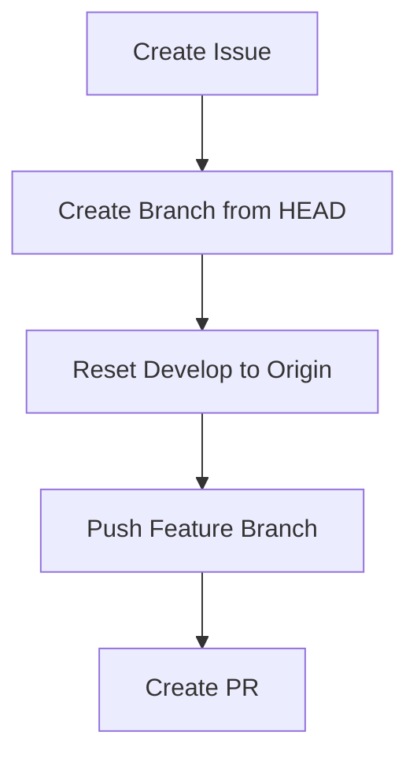

# Backend Recovery Plan (v1)

## Context
**Goal**: Correct the Git Workflow violation (Direct commits to `develop`) and restore strict adherence to `docs/development-guidelines.md`.
**Current State**: Local `develop` is 23 commits ahead of `origin/develop`. Features (Payment, Drafts, Wiki, Locking) are implemented but not linked to Issues/PRs properly.

## Work Objectives
1.  **Issue Creation**: Retroactively create a GitHub Issue for the backend implementation work.
2.  **Branch Migration**: Move the 23 local commits to a standard feature branch (`feat/#<issue>-backend-features`).
3.  **Develop Reset**: Hard reset local `develop` to match `origin/develop` (Clean Slate).
4.  **PR Submission**: Push the feature branch and create a Pull Request.

## Task Flow

## TODOs

- [ ] **1. Create GitHub Issue**
  - Title: "Implement Missing Backend Features (Payment, Drafts, Context, Locking)"
  - Body: Summary of 4 phases completed.
  - Output: Issue Number (e.g., #235).

- [ ] **2. Correct Branching**
  - Create branch `feat/#<issue>-backend-features` pointing to current `HEAD` (contains all work).
  - Checkout `develop`.
  - Fetch `origin`.
  - `git reset --hard origin/develop` (Warning: This wipes local develop changes, but they are safe in the feature branch).

- [ ] **3. Push & PR**
  - Checkout `feat/#<issue>-backend-features`.
  - `git push -u origin feat/#<issue>-backend-features`.
  - `gh pr create --fill` (Target: `develop`).

## Verification
- `git status` on `develop` should match `origin/develop`.
- GitHub PR should show all 23 commits.
- CI/CD checks will run on the PR.
