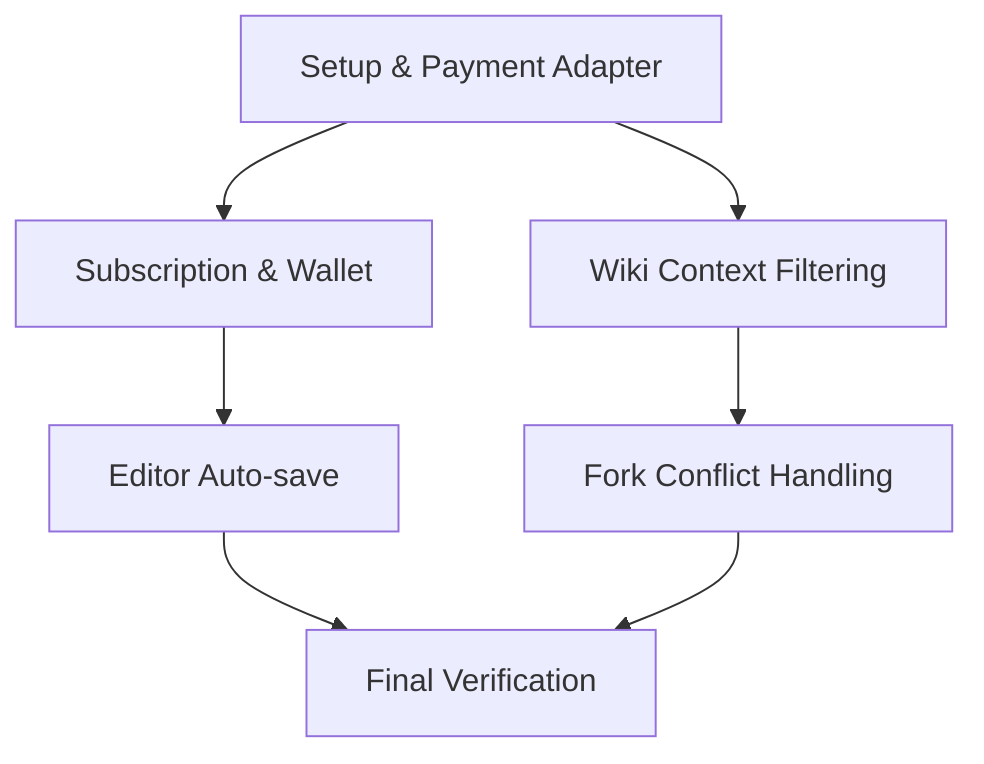

# Backend Development Plan (v1)

## Context
**Goal**: Implement missing backend features identified during Frontend E2E testing (`frontend-qa-v1`).
**Input**: `docs/backend-gap-report.md`, Metis Consultation.
**Outcome**: Fully functional backend supporting all frontend features (Payment, Editor, Forking).

## Strategy
- **Service Layer**: All logic resides in `services.py`.
- **TDD**: Write tests first (Red -> Green -> Refactor).
- **Payment**: Adapter pattern for Toss (primary) and Stripe (future).
- **Drafts**: Hybrid approach (Redis for speed + Periodic DB Sync).
- **Concurrency**: Optimistic locking (version field) for branching.

---

## Task Flow

---

## TODOs

### Phase 1: Foundation (Payment Integration)
**Goal**: Unblock `POST /subscriptions` and `POST /wallet/charge` with Toss Payments (Mocked initially).

- [x] **1.1 Payment Service Abstraction**
  - Create `apps/interactions/services/payment_service.py`.
  - Define `PaymentGatewayAdapter` interface:
    - `approve(order_id: str, amount: int) -> PaymentResult`
    - `cancel(payment_key: str, reason: str) -> PaymentResult`
    - `get_status(payment_key: str) -> PaymentStatus`
  - Implement `TossPaymentAdapter` (Mock implementation for now).
  - **Ref**: [Toss Payments API](https://docs.tosspayments.com/reference).
- [x] **1.2 Integrate Subscription Payment**
  - Update `SubscriptionService.subscribe()` to use `PaymentService`.
  - Add `@transaction.atomic`.
  - Tests: `tests/apps/interactions/test_subscription_payment.py`.
- [x] **1.3 Integrate Wallet Charging**
  - Update `WalletService.charge()` to use `PaymentService`.
  - Ensure `select_for_update` is maintained.
  - Tests: `tests/apps/interactions/test_wallet_payment.py`.

### Phase 2: Editor Auto-save (Real-time)
**Goal**: Enable reliable draft saving using Redis to prevent DB thrashing.

- [x] **2.1 Draft Service [ ] **2.1 Draft Service & Redis** Redis**
  - Create `apps/novels/services/draft_service.py`.
  - Use `django.core.cache.cache` (Redis backend).
  - Key Schema: `draft:{branch_id}:new` (for new chapter) or `draft:{branch_id}:{chapter_id}`.
  - Implement `save_draft(key, content)` and `get_draft(key)`.
  - Tests: `tests/apps/novels/test_draft_service.py`.
- [x] **2.2 Auto-save Endpoint**
  - Update `apps/contents/views.py`: Add `ChapterViewSet` action.
  - Route: `POST /branches/{branch_id}/chapters/draft`.
  - Body: `{ content: string, title?: string }`.
  - Tests: `tests/apps/contents/test_draft_endpoint.py`.
- [x] **2.3 Draft Persistence (Sync)**
  - Create Celery task `sync_drafts_to_db` (runs every 1 min).
  - Persist Redis drafts to `Chapter` model (status=DRAFT).
  - Tests: `tests/apps/contents/test_draft_sync.py`.

### Phase 3: Context Awareness (Wiki)
**Goal**: Prevent spoilers in Wiki List.

- [x] **3.1 Wiki List Context Filter**
  - Update `WikiEntryListSerializer` or `WikiService.list`.
  - **Logic**: Filter `WikiEntry` where `first_appearance <= currentChapter`.
  - Note: This differs from Snapshot logic (`valid_from_chapter`).
  - Tests: `tests/apps/contents/test_wiki_context.py`.

### Phase 4: Conflict Handling (Forking)
**Goal**: Prevent race conditions.

- [x] **4.1 Optimistic Locking**
  - Add `version` field to `Branch` model (migration required).
  - Update `BranchService.fork()` to check version (passed in request or fetched).
  - Return 409 Conflict on mismatch.
  - Tests: `tests/apps/novels/test_branch_concurrency.py`.
- [x] **4.2 Concurrency Tests**
  - Simulate concurrent fork requests in `tests/apps/novels/test_branch_concurrency.py`.

### Phase 5: Verification
- [x] **5.1 Run Full Backend Test Suite**
  - `pytest`
- [x] **5.2 Verify with Frontend E2E**
  - Run `npx playwright test` (using real backend if possible, or verify contracts).
