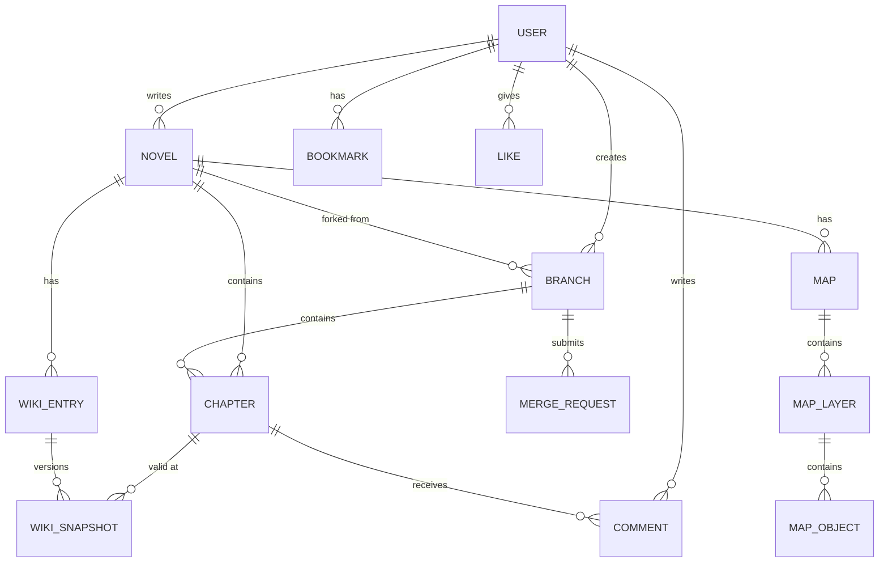

# 🏗️ ForkLore 백엔드 아키텍처 설계

**작성일**: 2026.01.02  
**작성자**: HueyJeong (with Gemini)  
**문서 버전**: v1.0

---

## 1. 개요 (Overview)

ForkLore 백엔드는 **Spring Boot 4.0.1 + Java 23** 기반의 모놀리식 아키텍처로 시작하며, 확장성을 고려한 **레이어드 아키텍처**를 채택합니다.

### 설계 원칙

| 원칙 | 설명 |
|------|------|
| **Layered Architecture** | Presentation → Service → Repository → Domain 분리 |
| **Domain-Driven Design** | 핵심 도메인(소설, 위키, 브랜치) 중심 설계 |
| **SOLID Principles** | 단일 책임, 개방-폐쇄, 의존성 역전 원칙 준수 |
| **RESTful API** | 자원 중심의 일관된 API 설계 |
| **Security by Default** | Spring Security 기반 인증/인가 |

---

## 2. 기술 스택

### 2.1 핵심 기술

| 구분 | 기술 | 버전 |
|------|------|------|
| **언어** | Java | 23 |
| **프레임워크** | Spring Boot | 4.0.1 |
| **빌드** | Gradle | 8.x (Wrapper) |
| **ORM** | Spring Data JPA + Hibernate | - |
| **보안** | Spring Security | - |
| **API 문서** | Springdoc OpenAPI | 3.0.0 |
| **유틸리티** | Lombok | - |

### 2.2 데이터베이스

| 환경 | DB | 용도 |
|------|-----|------|
| 개발/테스트 | H2 | 인메모리 DB, 빠른 테스트 |
| 운영 | PostgreSQL 18 | Core Data 저장 |
| 운영 | PostgreSQL + pgvector | 벡터 검색 (RAG용) |

### 2.3 인프라

| 구분 | 기술 |
|------|------|
| **컨테이너** | Docker Compose V2 |
| **개발 환경** | Dev Container (VS Code) |
| **CI/CD** | GitHub Actions (예정) |

---

## 3. 패키지 구조

```
backend/src/main/java/io/forklore/
├── ForkloreApplication.java          # Spring Boot 메인 클래스
├── config/                            # 설정 클래스
│   ├── SecurityConfig.java
│   ├── OpenApiConfig.java
│   ├── JpaConfig.java
│   └── WebConfig.java
│
├── domain/                            # 도메인 모델 (Entity)
│   ├── user/
│   │   ├── User.java
│   │   ├── UserRole.java
│   │   └── UserProfile.java
│   ├── novel/
│   │   ├── Novel.java
│   │   ├── Chapter.java
│   │   ├── Genre.java
│   │   └── NovelStatus.java
│   ├── wiki/
│   │   ├── WikiEntry.java
│   │   ├── WikiSnapshot.java
│   │   └── WikiCategory.java
│   ├── branch/
│   │   ├── Branch.java
│   │   ├── BranchStatus.java
│   │   └── MergeRequest.java
│   └── common/
│       ├── BaseEntity.java           # 공통 엔티티 (생성일, 수정일)
│       └── SoftDeletable.java        # 소프트 삭제 인터페이스
│
├── repository/                        # JPA 리포지토리
│   ├── user/
│   │   └── UserRepository.java
│   ├── novel/
│   │   ├── NovelRepository.java
│   │   └── ChapterRepository.java
│   ├── wiki/
│   │   └── WikiEntryRepository.java
│   └── branch/
│       └── BranchRepository.java
│
├── service/                           # 비즈니스 로직
│   ├── user/
│   │   ├── UserService.java
│   │   └── AuthService.java
│   ├── novel/
│   │   ├── NovelService.java
│   │   └── ChapterService.java
│   ├── wiki/
│   │   └── WikiService.java
│   ├── branch/
│   │   ├── BranchService.java
│   │   └── MergeService.java
│   └── ai/
│       ├── AIService.java
│       └── EmbeddingService.java
│
├── controller/                        # REST API 컨트롤러
│   ├── user/
│   │   ├── AuthController.java
│   │   └── UserController.java
│   ├── novel/
│   │   ├── NovelController.java
│   │   └── ChapterController.java
│   ├── wiki/
│   │   └── WikiController.java
│   └── branch/
│       └── BranchController.java
│
├── dto/                               # Data Transfer Objects
│   ├── request/
│   │   ├── SignUpRequest.java
│   │   ├── LoginRequest.java
│   │   ├── NovelCreateRequest.java
│   │   └── ChapterCreateRequest.java
│   ├── response/
│   │   ├── UserResponse.java
│   │   ├── NovelResponse.java
│   │   ├── ChapterResponse.java
│   │   └── ApiResponse.java          # 공통 응답 래퍼
│   └── mapper/
│       └── NovelMapper.java          # Entity ↔ DTO 변환
│
├── exception/                         # 예외 처리
│   ├── GlobalExceptionHandler.java   # @ControllerAdvice
│   ├── BusinessException.java        # 비즈니스 예외 기본 클래스
│   ├── NotFoundException.java
│   ├── UnauthorizedException.java
│   └── ValidationException.java
│
├── security/                          # 보안 관련
│   ├── jwt/
│   │   ├── JwtTokenProvider.java
│   │   ├── JwtAuthenticationFilter.java
│   │   └── JwtProperties.java
│   ├── oauth2/
│   │   ├── OAuth2SuccessHandler.java
│   │   └── CustomOAuth2UserService.java
│   └── UserPrincipal.java
│
└── util/                              # 유틸리티
    ├── MarkdownParser.java
    └── SlugGenerator.java
```

---

## 4. 레이어별 역할

### 4.1 Controller Layer (Presentation)

```
┌─────────────────────────────────────────────────────┐
│                  REST API 엔드포인트                 │
│  - HTTP 요청 수신 및 응답 반환                       │
│  - 입력 유효성 검증 (@Validated)                     │
│  - Swagger 문서화 (@Operation, @ApiResponse)        │
│  - 인증/인가 처리 (@PreAuthorize)                   │
└─────────────────────────────────────────────────────┘
```

**책임**:
- HTTP 요청/응답 처리
- DTO 변환 위임
- Swagger 어노테이션

**금지 사항**:
- 비즈니스 로직 포함 ❌
- Repository 직접 호출 ❌

### 4.2 Service Layer (Business)

```
┌─────────────────────────────────────────────────────┐
│                   비즈니스 로직                      │
│  - 도메인 규칙 적용                                  │
│  - 트랜잭션 관리 (@Transactional)                   │
│  - 여러 Repository 조합                             │
│  - 외부 서비스 연동 (AI API 등)                     │
└─────────────────────────────────────────────────────┘
```

**책임**:
- 핵심 비즈니스 로직
- 도메인 간 조율
- 트랜잭션 경계 설정

**금지 사항**:
- HTTP 관련 로직 ❌
- DTO 직접 반환 (선택적) ❌

### 4.3 Repository Layer (Persistence)

```
┌─────────────────────────────────────────────────────┐
│                  데이터 접근 계층                    │
│  - JPA Repository 인터페이스                         │
│  - 커스텀 쿼리 메서드                                │
│  - QueryDSL / Native Query (복잡한 경우)            │
└─────────────────────────────────────────────────────┘
```

**책임**:
- CRUD 연산
- 페이징, 정렬
- 복잡한 조회 쿼리

### 4.4 Domain Layer (Entity)

```
┌─────────────────────────────────────────────────────┐
│                    도메인 모델                       │
│  - JPA Entity (@Entity, @Table)                     │
│  - 도메인 로직 캡슐화 (Rich Domain Model)            │
│  - 불변 규칙 (Invariants) 보장                      │
└─────────────────────────────────────────────────────┘
```

**책임**:
- 엔티티 정의
- 도메인 규칙 캡슐화
- 연관관계 관리

---

## 5. 핵심 도메인 모델

### 5.1 도메인 관계도



### 5.2 주요 엔티티 설계

#### User (사용자)

```java
@Entity
@Table(name = "users")
public class User extends BaseEntity implements SoftDeletable {
    @Id @GeneratedValue
    private Long id;
    
    @Column(unique = true, nullable = false)
    private String email;
    
    private String password;  // BCrypt 암호화
    
    @Column(unique = true, nullable = false)
    private String nickname;
    
    @Enumerated(EnumType.STRING)
    private UserRole role;  // READER, AUTHOR, ADMIN
    
    @Enumerated(EnumType.STRING)
    private AuthProvider provider;  // LOCAL, GOOGLE, KAKAO
    
    private String profileImageUrl;
    private String bio;
    
    // 마일리지, 코인
    private Integer mileage = 0;
    private Integer coin = 0;
    
    private boolean deleted = false;
}
```

#### Novel (소설)

```java
@Entity
@Table(name = "novels")
public class Novel extends BaseEntity implements SoftDeletable {
    @Id @GeneratedValue
    private Long id;
    
    @ManyToOne(fetch = FetchType.LAZY)
    private User author;
    
    @Column(nullable = false)
    private String title;
    
    @Column(columnDefinition = "TEXT")
    private String description;
    
    private String coverImageUrl;
    
    @Enumerated(EnumType.STRING)
    private Genre genre;
    
    @Enumerated(EnumType.STRING)
    private NovelStatus status;  // ONGOING, COMPLETED, HIATUS
    
    @ElementCollection
    @CollectionTable(name = "novel_tags")
    private Set<String> tags = new HashSet<>();
    
    @OneToMany(mappedBy = "novel", cascade = CascadeType.ALL)
    @OrderBy("chapterNumber ASC")
    private List<Chapter> chapters = new ArrayList<>();
    
    // 통계
    private Long viewCount = 0L;
    private Long likeCount = 0L;
    
    private boolean deleted = false;
}
```

#### Chapter (회차)

```java
@Entity
@Table(name = "chapters")
public class Chapter extends BaseEntity {
    @Id @GeneratedValue
    private Long id;
    
    @ManyToOne(fetch = FetchType.LAZY)
    private Novel novel;
    
    private Integer chapterNumber;
    
    @Column(nullable = false)
    private String title;
    
    @Column(columnDefinition = "TEXT", nullable = false)
    private String content;  // Markdown
    
    @Enumerated(EnumType.STRING)
    private ChapterStatus status;  // DRAFT, SCHEDULED, PUBLISHED
    
    private LocalDateTime publishedAt;
    private LocalDateTime scheduledAt;
    
    private Long viewCount = 0L;
    private Long likeCount = 0L;
    
    private boolean isPaid = false;
    private Integer price = 0;  // 코인 단위
}
```

#### WikiEntry (위키 항목)

```java
@Entity
@Table(name = "wiki_entries")
public class WikiEntry extends BaseEntity {
    @Id @GeneratedValue
    private Long id;
    
    @ManyToOne(fetch = FetchType.LAZY)
    private Novel novel;
    
    @Column(nullable = false)
    private String name;
    
    @Enumerated(EnumType.STRING)
    private WikiCategory category;  // CHARACTER, LOCATION, ITEM, CONCEPT
    
    private String imageUrl;
    
    // 스냅샷 버전 관리 (문맥 인식 위키)
    @OneToMany(mappedBy = "wikiEntry", cascade = CascadeType.ALL)
    @OrderBy("validFromChapter DESC")
    private List<WikiSnapshot> snapshots = new ArrayList<>();
    
    // 작가 전용 비공개 메모
    @Column(columnDefinition = "TEXT")
    private String hiddenNote;
    
    private Integer firstAppearanceChapter;
}
```

#### WikiSnapshot (위키 스냅샷)

```java
@Entity
@Table(name = "wiki_snapshots")
public class WikiSnapshot extends BaseEntity {
    @Id @GeneratedValue
    private Long id;
    
    @ManyToOne(fetch = FetchType.LAZY)
    private WikiEntry wikiEntry;
    
    @Column(columnDefinition = "TEXT")
    private String summary;
    
    @Column(columnDefinition = "TEXT")
    private String fullDescription;
    
    // 문맥 인식: 이 스냅샷이 유효한 시작 회차
    private Integer validFromChapter;
    
    // 기여자 (AI 또는 사용자)
    private String contributor;
}
```

#### Branch (브랜치)

```java
@Entity
@Table(name = "branches")
public class Branch extends BaseEntity implements SoftDeletable {
    @Id @GeneratedValue
    private Long id;
    
    @ManyToOne(fetch = FetchType.LAZY)
    private Novel originalNovel;
    
    @ManyToOne(fetch = FetchType.LAZY)
    private User author;  // 팬작가
    
    @Column(nullable = false)
    private String title;  // IF: ...
    
    @Column(columnDefinition = "TEXT")
    private String description;
    
    private String coverImageUrl;
    
    // 분기 포인트
    private Integer forkPointChapter;
    
    @Enumerated(EnumType.STRING)
    private BranchStatus status;  // ACTIVE, CANDIDATE, REVIEWING, MERGED
    
    @OneToMany(mappedBy = "branch", cascade = CascadeType.ALL)
    private List<Chapter> chapters = new ArrayList<>();
    
    private Long voteCount = 0L;
    private Long viewCount = 0L;
    
    private boolean deleted = false;
}
```

---

## 6. 횡단 관심사 (Cross-Cutting Concerns)

### 6.1 인증/인가

```
┌─────────────────────────────────────────────────────┐
│                   JWT 기반 인증                      │
│                                                     │
│  1. 로그인 → Access Token + Refresh Token 발급      │
│  2. API 요청 → Bearer Token 검증                    │
│  3. Token 만료 → Refresh Token으로 갱신             │
│  4. 인가 → @PreAuthorize("hasRole('AUTHOR')")       │
└─────────────────────────────────────────────────────┘
```

### 6.2 예외 처리

```java
@ControllerAdvice
public class GlobalExceptionHandler {
    
    @ExceptionHandler(NotFoundException.class)
    public ResponseEntity<ApiResponse<Void>> handleNotFound(NotFoundException e) {
        return ResponseEntity.status(HttpStatus.NOT_FOUND)
            .body(ApiResponse.error(e.getMessage()));
    }
    
    @ExceptionHandler(ValidationException.class)
    public ResponseEntity<ApiResponse<Void>> handleValidation(ValidationException e) {
        return ResponseEntity.status(HttpStatus.BAD_REQUEST)
            .body(ApiResponse.error(e.getMessage()));
    }
    
    // ...
}
```

### 6.3 공통 응답 형식

```java
@Data
@Builder
public class ApiResponse<T> {
    private boolean success;
    private String message;
    private T data;
    private LocalDateTime timestamp;
    
    public static <T> ApiResponse<T> success(T data) {
        return ApiResponse.<T>builder()
            .success(true)
            .data(data)
            .timestamp(LocalDateTime.now())
            .build();
    }
    
    public static <T> ApiResponse<T> error(String message) {
        return ApiResponse.<T>builder()
            .success(false)
            .message(message)
            .timestamp(LocalDateTime.now())
            .build();
    }
}
```

### 6.4 감사 (Auditing)

```java
@MappedSuperclass
@EntityListeners(AuditingEntityListener.class)
public abstract class BaseEntity {
    
    @CreatedDate
    @Column(updatable = false)
    private LocalDateTime createdAt;
    
    @LastModifiedDate
    private LocalDateTime updatedAt;
    
    @CreatedBy
    @Column(updatable = false)
    private String createdBy;
    
    @LastModifiedBy
    private String updatedBy;
}
```

---

## 7. 외부 서비스 연동

### 7.1 AI 서비스 (OpenAI API)

```
┌─────────────────────────────────────────────────────┐
│                 AI Service Layer                    │
│                                                     │
│  AIService                                          │
│  ├── generateWikiSuggestion(chapterContent)         │
│  ├── checkConsistency(novelId, newContent)          │
│  └── answerQuestion(novelId, currentChapter, query) │
│                                                     │
│  EmbeddingService                                   │
│  ├── embed(text) → float[]                          │
│  └── search(embedding, limit) → List<ChunkResult>   │
└─────────────────────────────────────────────────────┘
```

### 7.2 벡터 DB (pgvector)

```sql
-- 확장 설치
CREATE EXTENSION IF NOT EXISTS vector;

-- 청크 테이블
CREATE TABLE chapter_chunks (
    id SERIAL PRIMARY KEY,
    chapter_id BIGINT REFERENCES chapters(id),
    chunk_index INTEGER,
    content TEXT,
    embedding vector(1536)  -- OpenAI ada-002 차원
);

-- 인덱스
CREATE INDEX ON chapter_chunks USING ivfflat (embedding vector_cosine_ops);
```

---

## 8. 환경 설정 전략

### 8.1 프로파일 구조

```
application.yml              # 공통 설정
application-local.yml        # 로컬 개발 (H2)
application-dev.yml          # Docker 개발 환경 (PostgreSQL)
application-prod.yml         # 운영 환경
```

### 8.2 주요 설정 항목

```yaml
# application.yml
spring:
  application:
    name: forklore
  
  jpa:
    hibernate:
      ddl-auto: validate  # 운영: validate, 개발: update
    open-in-view: false
    properties:
      hibernate:
        format_sql: true
        
  data:
    web:
      pageable:
        default-page-size: 20
        max-page-size: 100

# JWT 설정
jwt:
  secret: ${JWT_SECRET}
  access-token-expiration: 3600000   # 1시간
  refresh-token-expiration: 604800000 # 7일

# AI 설정  
ai:
  openai:
    api-key: ${OPENAI_API_KEY}
    model: gpt-4
    embedding-model: text-embedding-ada-002
```

---

## 9. 테스트 전략

### 9.1 테스트 피라미드

```
        ┌─────────┐
        │  E2E   │  ← 최소화 (API 통합 테스트)
       ┌───────────┐
       │Integration│  ← 서비스 + Repository
     ┌───────────────┐
     │    Unit      │  ← Service, Domain 로직
   └─────────────────┘
```

### 9.2 테스트 구성

| 레벨 | 도구 | 대상 |
|------|------|------|
| Unit | JUnit 5 + Mockito | Service, Domain |
| Integration | @DataJpaTest | Repository |
| Integration | @WebMvcTest | Controller |
| E2E | @SpringBootTest + TestRestTemplate | 전체 플로우 |
| Security | @WithMockUser | 인증/인가 |

---

## 10. 배포 구조 (향후)

```
┌──────────────────────────────────────────────────────────┐
│                     Load Balancer                        │
└──────────────────────────────────────────────────────────┘
                            │
         ┌──────────────────┼──────────────────┐
         ▼                  ▼                  ▼
    ┌─────────┐        ┌─────────┐        ┌─────────┐
    │  App 1  │        │  App 2  │        │  App 3  │
    │ (Spring)│        │ (Spring)│        │ (Spring)│
    └─────────┘        └─────────┘        └─────────┘
         │                  │                  │
         └──────────────────┼──────────────────┘
                            │
                   ┌────────┴────────┐
                   ▼                 ▼
            ┌───────────┐     ┌───────────┐
            │ PostgreSQL│     │   Redis   │
            │  Primary  │     │  (Cache)  │
            └───────────┘     └───────────┘
```

---

## 문서 끝
