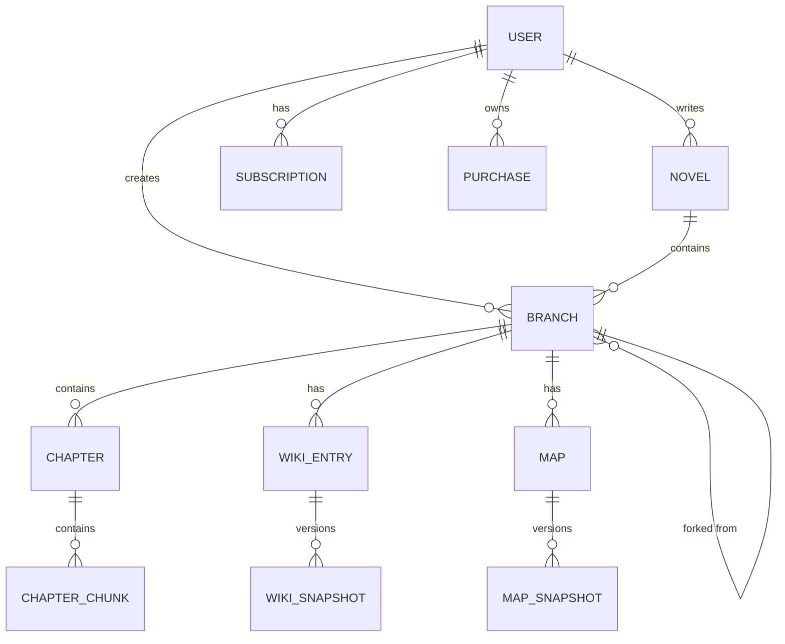

# 🏗️ ForkLore 백엔드 아키텍처 설계

**작성일**: 2026.01.02  
**작성자**: HueyJeong (with Gemini)  
**문서 버전**: v4.0 (최종)

---

## 1. 개요 (Overview)

ForkLore 백엔드는 **Spring Boot 4.0.1 + Java 23** 기반의 모놀리식 아키텍처로 시작하며, 확장성을 고려한 **레이어드 아키텍처**를 채택합니다.

### 설계 원칙

| 원칙 | 설명 |
|------|------|
| **Layered Architecture** | Presentation → Service → Repository → Domain 분리 |
| **Domain-Driven Design** | 핵심 도메인(소설, 브랜치, 위키) 중심 설계 |
| **SOLID Principles** | 단일 책임, 개방-폐쇄, 의존성 역전 원칙 준수 |
| **RESTful API** | 자원 중심의 일관된 API 설계 |
| **TDD** | 테스트 우선 개발로 동작 보장 |

---

## 2. 기술 스택

### 2.1 핵심 기술

| 구분 | 기술 | 버전 |
|------|------|------|
| **언어** | Java | 23 |
| **프레임워크** | Spring Boot | 4.0.1 |
| **빌드** | Gradle | 8.x (Wrapper) |
| **ORM** | Spring Data JPA + Hibernate | - |
| **보안** | Spring Security | - |
| **API 문서** | Springdoc OpenAPI | 3.0.0 |
| **유틸리티** | Lombok | - |

### 2.2 데이터베이스

| 환경 | DB | 용도 |
|------|-----|------|
| 개발/테스트 | H2 | 인메모리 DB |
| 운영 | PostgreSQL 18 | Core Data |
| 운영 | PostgreSQL + pgvector | 벡터 검색 (Gemini Embedding 3072차원) |

### 2.3 인프라

| 구분 | 기술 |
|------|------|
| **컨테이너** | Docker Compose V2 |
| **개발 환경** | Dev Container (VS Code) |
| **CI/CD** | GitHub Actions (예정) |

---

## 3. 패키지 구조

```
backend/src/main/java/io/forklore/
├── ForkloreApplication.java
├── config/
│   ├── SecurityConfig.java
│   ├── OpenApiConfig.java
│   ├── JpaConfig.java
│   └── WebConfig.java
│
├── domain/
│   ├── user/
│   │   ├── User.java
│   │   └── UserRole.java
│   ├── novel/
│   │   ├── Novel.java
│   │   ├── AgeRating.java          # ALL, 12, 15, 19
│   │   ├── Genre.java
│   │   └── NovelStatus.java
│   ├── branch/
│   │   ├── Branch.java             # 메인 + 파생 통합
│   │   ├── BranchType.java         # MAIN, SIDE_STORY, FAN_FIC, IF_STORY
│   │   ├── BranchVisibility.java   # PRIVATE, PUBLIC, LINKED
│   │   └── BranchLinkRequest.java
│   ├── chapter/
│   │   ├── Chapter.java            # 브랜치에 귀속
│   │   ├── ChapterStatus.java
│   │   ├── AccessType.java         # FREE, SUBSCRIPTION
│   │   └── ChapterChunk.java       # 벡터 임베딩
│   ├── wiki/
│   │   ├── WikiEntry.java          # 브랜치별 위키
│   │   ├── WikiSnapshot.java
│   │   └── WikiTagDefinition.java
│   ├── map/
│   │   ├── Map.java                # 브랜치별 지도
│   │   ├── MapSnapshot.java
│   │   ├── MapLayer.java
│   │   └── MapObject.java
│   ├── subscription/
│   │   ├── Subscription.java       # 구독
│   │   └── Purchase.java           # 소장
│   ├── reading/
│   │   ├── ReadingLog.java
│   │   └── Bookmark.java
│   └── common/
│       ├── BaseEntity.java
│       └── SoftDeletable.java
│
├── repository/
│   ├── user/UserRepository.java
│   ├── novel/NovelRepository.java
│   ├── branch/BranchRepository.java
│   ├── chapter/ChapterRepository.java
│   ├── wiki/WikiEntryRepository.java
│   ├── map/MapRepository.java
│   └── subscription/SubscriptionRepository.java
│
├── service/
│   ├── user/
│   │   ├── UserService.java
│   │   └── AuthService.java
│   ├── novel/NovelService.java
│   ├── branch/
│   │   ├── BranchService.java
│   │   └── BranchLinkService.java
│   ├── chapter/ChapterService.java
│   ├── wiki/WikiService.java
│   ├── map/MapService.java
│   ├── subscription/
│   │   ├── SubscriptionService.java
│   │   └── PurchaseService.java
│   ├── reading/ReadingService.java
│   └── ai/
│       ├── AIService.java
│       └── EmbeddingService.java
│
├── controller/
│   ├── AuthController.java
│   ├── UserController.java
│   ├── NovelController.java
│   ├── BranchController.java
│   ├── ChapterController.java
│   ├── WikiController.java
│   ├── MapController.java
│   ├── SubscriptionController.java
│   └── AIController.java
│
├── dto/
│   ├── request/
│   │   ├── SignUpRequest.java
│   │   ├── LoginRequest.java
│   │   ├── NovelCreateRequest.java
│   │   └── ChapterCreateRequest.java
│   ├── response/
│   │   ├── UserResponse.java
│   │   ├── NovelResponse.java
│   │   ├── ChapterResponse.java
│   │   └── ApiResponse.java
│   └── mapper/
│       └── NovelMapper.java
│
├── exception/
│   ├── GlobalExceptionHandler.java
│   ├── BusinessException.java
│   ├── NotFoundException.java
│   ├── UnauthorizedException.java
│   └── ValidationException.java
│
├── security/
│   ├── jwt/
│   │   ├── JwtTokenProvider.java
│   │   ├── JwtAuthenticationFilter.java
│   │   └── JwtProperties.java
│   ├── oauth2/
│   │   ├── OAuth2SuccessHandler.java
│   │   └── CustomOAuth2UserService.java
│   └── UserPrincipal.java
│
└── util/
    ├── MarkdownParser.java
    └── SlugGenerator.java
```

---

## 4. 레이어별 역할

### 4.1 Controller Layer (Presentation)

```
┌─────────────────────────────────────────────────────┐
│                  REST API 엔드포인트                 │
│  - HTTP 요청 수신 및 응답 반환                       │
│  - 입력 유효성 검증 (@Validated)                     │
│  - Swagger 문서화 (@Operation, @ApiResponse)        │
│  - 인증/인가 처리 (@PreAuthorize)                   │
└─────────────────────────────────────────────────────┘
```

**책임**:
- HTTP 요청/응답 처리
- DTO 변환 위임
- Swagger 어노테이션

**금지 사항**:
- 비즈니스 로직 포함 ❌
- Repository 직접 호출 ❌

### 4.2 Service Layer (Business)

```
┌─────────────────────────────────────────────────────┐
│                   비즈니스 로직                      │
│  - 도메인 규칙 적용                                  │
│  - 트랜잭션 관리 (@Transactional)                   │
│  - 여러 Repository 조합                             │
│  - 외부 서비스 연동 (AI API 등)                     │
└─────────────────────────────────────────────────────┘
```

**책임**:
- 핵심 비즈니스 로직
- 도메인 간 조율
- 트랜잭션 경계 설정

**금지 사항**:
- HTTP 관련 로직 ❌

### 4.3 Repository Layer (Persistence)

```
┌─────────────────────────────────────────────────────┐
│                  데이터 접근 계층                    │
│  - JPA Repository 인터페이스                         │
│  - 커스텀 쿼리 메서드                                │
│  - QueryDSL / Native Query (복잡한 경우)            │
└─────────────────────────────────────────────────────┘
```

**책임**:
- CRUD 연산
- 페이징, 정렬
- 복잡한 조회 쿼리

### 4.4 Domain Layer (Entity)

```
┌─────────────────────────────────────────────────────┐
│                    도메인 모델                       │
│  - JPA Entity (@Entity, @Table)                     │
│  - 도메인 로직 캡슐화 (Rich Domain Model)            │
│  - 불변 규칙 (Invariants) 보장                      │
└─────────────────────────────────────────────────────┘
```

**책임**:
- 엔티티 정의
- 도메인 규칙 캡슐화
- 연관관계 관리

---

## 5. 핵심 도메인 모델 (v4)

### 5.1 도메인 관계도



### 5.2 주요 엔티티 설계

#### Novel (소설 - 메타 컨테이너)

```java
@Entity
@Table(name = "novels")
public class Novel extends BaseEntity implements SoftDeletable {
    @Id @GeneratedValue
    private Long id;
    
    @ManyToOne(fetch = FetchType.LAZY)
    private User author;
    
    @Column(nullable = false)
    private String title;
    
    @Column(columnDefinition = "TEXT")
    private String description;
    
    private String coverImageUrl;
    
    @Enumerated(EnumType.STRING)
    private Genre genre;
    
    @Enumerated(EnumType.STRING)
    private AgeRating ageRating = AgeRating.ALL;  // ALL, 12, 15, 19
    
    @Enumerated(EnumType.STRING)
    private NovelStatus status = NovelStatus.ONGOING;
    
    private boolean allowBranching = true;
    
    // 집계 (캐시)
    private Long totalViewCount = 0L;
    private Long totalLikeCount = 0L;
    private Integer totalChapterCount = 0;
    private Integer branchCount = 1;
    
    private LocalDateTime deletedAt;
}
```

#### Branch (브랜치 - 메인 + 파생 통합)

```java
@Entity
@Table(name = "branches")
public class Branch extends BaseEntity implements SoftDeletable {
    @Id @GeneratedValue
    private Long id;
    
    @ManyToOne(fetch = FetchType.LAZY)
    private Novel novel;
    
    @ManyToOne(fetch = FetchType.LAZY)
    private User author;
    
    // 메인 브랜치 여부 (소설당 하나만 true)
    private boolean isMain = false;
    
    // 파생 시 부모 브랜치 + 분기점
    @ManyToOne(fetch = FetchType.LAZY)
    private Branch parentBranch;
    private Integer forkPointChapter;
    
    @Column(nullable = false)
    private String name;
    
    @Column(columnDefinition = "TEXT")
    private String description;
    
    private String coverImageUrl;
    
    @Enumerated(EnumType.STRING)
    private BranchType branchType = BranchType.FAN_FIC;
    
    @Enumerated(EnumType.STRING)
    private BranchVisibility visibility = BranchVisibility.PRIVATE;
    
    @Enumerated(EnumType.STRING)
    private CanonStatus canonStatus = CanonStatus.NON_CANON;
    private Integer mergedAtChapter;
    
    private Long voteCount = 0L;
    private Integer voteThreshold = 1000;
    private Long viewCount = 0L;
    private Integer chapterCount = 0;
    
    private LocalDateTime deletedAt;
}
```

#### Chapter (회차 - 브랜치 귀속)

```java
@Entity
@Table(name = "chapters")
public class Chapter extends BaseEntity {
    @Id @GeneratedValue
    private Long id;
    
    @ManyToOne(fetch = FetchType.LAZY)
    private Branch branch;
    
    private Integer chapterNumber;
    
    @Column(nullable = false)
    private String title;
    
    @Column(columnDefinition = "TEXT", nullable = false)
    private String content;       // 마크다운 원본
    
    @Column(columnDefinition = "TEXT")
    private String contentHtml;   // 렌더링 캐시
    
    private Integer wordCount = 0;
    
    @Enumerated(EnumType.STRING)
    private ChapterStatus status = ChapterStatus.DRAFT;
    
    @Enumerated(EnumType.STRING)
    private AccessType accessType = AccessType.FREE;
    
    private Integer price = 0;
    
    private LocalDateTime scheduledAt;
    private LocalDateTime publishedAt;
    
    private Long viewCount = 0L;
    private Long likeCount = 0L;
    private Integer commentCount = 0;
}
```

#### WikiEntry (위키 - 브랜치 귀속)

```java
@Entity
@Table(name = "wiki_entries")
public class WikiEntry extends BaseEntity {
    @Id @GeneratedValue
    private Long id;
    
    @ManyToOne(fetch = FetchType.LAZY)
    private Branch branch;
    
    @ManyToOne(fetch = FetchType.LAZY)
    private WikiEntry sourceWiki;  // 포크 시 원본
    
    @Column(nullable = false)
    private String name;
    
    private String imageUrl;
    private Integer firstAppearance;
    
    @Column(columnDefinition = "TEXT")
    private String hiddenNote;
    
    @Type(JsonBinaryType.class)
    @Column(columnDefinition = "jsonb")
    private Map<String, Object> aiMetadata;
    
    @OneToMany(mappedBy = "wikiEntry", cascade = CascadeType.ALL)
    @OrderBy("validFromChapter DESC")
    private List<WikiSnapshot> snapshots = new ArrayList<>();
    
    @ManyToMany
    @JoinTable(name = "wiki_tags")
    private Set<WikiTagDefinition> tags = new HashSet<>();
}
```

---

## 6. 횡단 관심사 (Cross-Cutting Concerns)

### 6.1 공통 응답 형식 (ApiResponse)

```java
@Data
@Builder
public class ApiResponse<T> {
    private boolean success;
    private String message;
    private T data;
    private LocalDateTime timestamp;
    
    public static <T> ApiResponse<T> success(T data) {
        return ApiResponse.<T>builder()
            .success(true)
            .data(data)
            .timestamp(LocalDateTime.now())
            .build();
    }
    
    public static <T> ApiResponse<T> error(String message) {
        return ApiResponse.<T>builder()
            .success(false)
            .message(message)
            .timestamp(LocalDateTime.now())
            .build();
    }
}
```

### 6.2 전역 예외 처리

```java
@ControllerAdvice
public class GlobalExceptionHandler {
    
    @ExceptionHandler(NotFoundException.class)
    public ResponseEntity<ApiResponse<Void>> handleNotFound(NotFoundException e) {
        return ResponseEntity.status(HttpStatus.NOT_FOUND)
            .body(ApiResponse.error(e.getMessage()));
    }
    
    @ExceptionHandler(UnauthorizedException.class)
    public ResponseEntity<ApiResponse<Void>> handleUnauthorized(UnauthorizedException e) {
        return ResponseEntity.status(HttpStatus.UNAUTHORIZED)
            .body(ApiResponse.error(e.getMessage()));
    }
    
    @ExceptionHandler(MethodArgumentNotValidException.class)
    public ResponseEntity<ApiResponse<Void>> handleValidation(MethodArgumentNotValidException e) {
        return ResponseEntity.status(HttpStatus.BAD_REQUEST)
            .body(ApiResponse.error("유효성 검사 실패"));
    }
}
```

### 6.3 감사 (Auditing)

```java
@MappedSuperclass
@EntityListeners(AuditingEntityListener.class)
public abstract class BaseEntity {
    
    @CreatedDate
    @Column(updatable = false)
    private LocalDateTime createdAt;
    
    @LastModifiedDate
    private LocalDateTime updatedAt;
}
```

### 6.4 JWT 인증/인가

```
┌─────────────────────────────────────────────────────┐
│                   JWT 기반 인증                      │
│                                                     │
│  1. 로그인 → Access Token + Refresh Token 발급      │
│  2. API 요청 → Bearer Token 검증                    │
│  3. Token 만료 → Refresh Token으로 갱신             │
│  4. 인가 → @PreAuthorize("hasRole('AUTHOR')")       │
└─────────────────────────────────────────────────────┘
```

### 6.5 열람 권한 검사

```java
@Service
public class AccessService {
    
    public boolean canAccessChapter(Long userId, Chapter chapter) {
        // 1. FREE 회차
        if (chapter.getAccessType() == AccessType.FREE) return true;
        
        // 2. 소장 중
        if (purchaseRepository.existsByUserIdAndChapterId(userId, chapter.getId())) {
            return true;
        }
        
        // 3. 구독 중
        return subscriptionRepository.existsActiveByUserId(userId);
    }
}
```

---

## 7. AI 서비스 연동

### 7.1 Gemini API

```java
@Service
public class EmbeddingService {
    private static final int EMBEDDING_DIMENSION = 3072;
    
    public float[] embed(String text) {
        // Gemini Embedding 001 호출
    }
    
    public List<ChunkResult> search(float[] embedding, int limit) {
        // pgvector 유사도 검색
    }
}
```

### 7.2 벡터 DB (pgvector)

```sql
CREATE EXTENSION IF NOT EXISTS vector;

CREATE TABLE chapter_chunks (
    id SERIAL PRIMARY KEY,
    chapter_id BIGINT REFERENCES chapters(id),
    chunk_index INTEGER,
    content TEXT,
    embedding vector(3072)  -- Gemini Embedding 001
);

CREATE INDEX ON chapter_chunks 
    USING ivfflat (embedding vector_cosine_ops) WITH (lists = 100);
```

---

## 8. 환경 설정

```yaml
spring:
  application:
    name: forklore
  
  jpa:
    hibernate:
      ddl-auto: validate
    open-in-view: false
    properties:
      hibernate:
        format_sql: true
        
  data:
    web:
      pageable:
        default-page-size: 20
        max-page-size: 100

jwt:
  secret: ${JWT_SECRET}
  access-token-expiration: 3600000
  refresh-token-expiration: 604800000

ai:
  gemini:
    api-key: ${GEMINI_API_KEY}
    model: gemini-1.5-pro
    embedding-model: text-embedding-001
    embedding-dimension: 3072
```

---

## 9. 테스트 전략

### 9.1 테스트 피라미드

```
        ┌─────────┐
        │  E2E   │  ← 최소화 (API 통합 테스트)
       ┌───────────┐
       │Integration│  ← 서비스 + Repository
     ┌───────────────┐
     │    Unit      │  ← Service, Domain 로직
   └─────────────────┘
```

### 9.2 테스트 구성

| 레벨 | 도구 | 대상 |
|------|------|------|
| Unit | JUnit 5 + Mockito | Service, Domain |
| Integration | @DataJpaTest | Repository |
| Integration | @WebMvcTest | Controller |
| E2E | @SpringBootTest + TestRestTemplate | 전체 플로우 |
| Security | @WithMockUser | 인증/인가 |

### 9.3 TDD 원칙

- **Red → Green → Refactor** 사이클 준수
- 기능 구현 전 테스트 먼저 작성
- 테스트 커버리지 70% 이상 유지

---

## 10. 배포 구조 (향후)

```
┌──────────────────────────────────────────────────────────┐
│                     Load Balancer                        │
└──────────────────────────────────────────────────────────┘
                            │
         ┌──────────────────┼──────────────────┐
         ▼                  ▼                  ▼
    ┌─────────┐        ┌─────────┐        ┌─────────┐
    │  App 1  │        │  App 2  │        │  App 3  │
    │ (Spring)│        │ (Spring)│        │ (Spring)│
    └─────────┘        └─────────┘        └─────────┘
         │                  │                  │
         └──────────────────┼──────────────────┘
                            │
                   ┌────────┴────────┐
                   ▼                 ▼
            ┌───────────┐     ┌───────────┐
            │ PostgreSQL│     │   Redis   │
            │  Primary  │     │  (Cache)  │
            └───────────┘     └───────────┘
```

---

## 문서 끝
