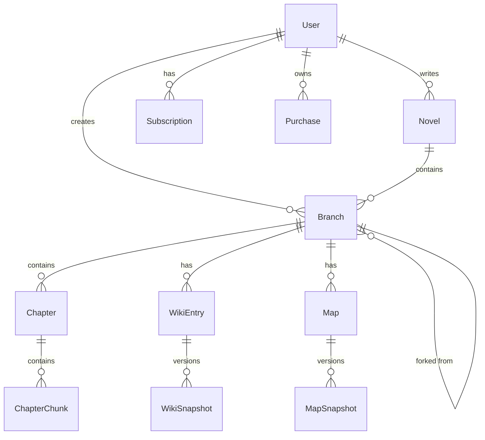

# 🏗️ ForkLore 백엔드 아키텍처 설계 (Django)

**작성일**: 2026.01.13  
**작성자**: HueyJeong (with AI)  
**문서 버전**: v5.1 (DB/응답규약/camelCase 정합성 보강)

---

## 1. 개요 (Overview)

ForkLore 백엔드는 **Django 5.1+ / Python 3.12+** 기반의 모놀리식 아키텍처로, **Django REST Framework (DRF)**를 사용하여 RESTful API를 제공합니다.

### 설계 원칙

| 원칙 | 설명 |
|------|------|
| **App-based Architecture** | 기능 도메인별 Django App 분리 |
| **Fat Models, Thin Views** | 비즈니스 로직은 Model 또는 Service 레이어에 캡슐화 |
| **Service Layer** | 복잡한 비즈니스 로직은 `services/` 모듈로 분리 |
| **DRF Conventions** | Serializer, ViewSet, Router 패턴 준수 |
| **TDD** | pytest-django 기반 테스트 우선 개발 |

---

## 2. 기술 스택

### 2.1 핵심 기술

| 구분 | 기술 | 버전 |
|------|------|------|
| **언어** | Python | 3.12+ |
| **프레임워크** | Django | 5.1+ |
| **API 프레임워크** | Django REST Framework | 3.15+ |
| **패키지 관리** | Poetry | latest |
| **인증** | SimpleJWT + dj-rest-auth | - |
| **API 문서** | drf-spectacular | 0.27+ |

### 2.2 데이터베이스 (모든 환경 동일)

| 환경 | DB | 용도 |
|------|-----|------|
| 개발 | PostgreSQL 18 | Core Data + JSONB |
| 테스트 | PostgreSQL 18 | pgvector 포함 전제 |
| 운영 | PostgreSQL 18 | Core Data + pgvector |

> SQLite는 pgvector/JSONB 및 실제 운영 특성과 불일치하므로 사용하지 않는다.

### 2.3 인프라

| 구분 | 기술 |
|------|------|
| **컨테이너** | Docker Compose (루트 디렉토리) |
| **비동기 태스크** | Celery + Redis |
| **CI/CD** | GitHub Actions (예정) |

---

## 3. 프로젝트 구조

```
backend/
├── pyproject.toml           # Poetry 의존성 정의
├── poetry.lock
├── manage.py
├── pytest.ini               # pytest 설정
│
├── config/                  # 프로젝트 설정 (settings, urls, wsgi, asgi)
│   ├── __init__.py
│   ├── settings/
│   │   ├── __init__.py
│   │   ├── base.py          # 공통 설정
│   │   ├── local.py         # 로컬 개발
│   │   ├── production.py    # 운영
│   │   └── test.py          # 테스트
│   ├── urls.py
│   ├── wsgi.py
│   └── asgi.py
│
├── apps/                    # 기능별 Django 앱
│   ├── __init__.py
│   ├── users/               # 사용자 및 인증
│   │   ├── __init__.py
│   │   ├── models.py        # User, UserRole
│   │   ├── serializers.py
│   │   ├── views.py
│   │   ├── urls.py
│   │   ├── services.py      # AuthService, UserService
│   │   ├── permissions.py
│   │   └── tests/
│   │       ├── __init__.py
│   │       ├── test_models.py
│   │       ├── test_serializers.py
│   │       └── test_views.py
│   │
│   ├── novels/              # 소설 및 브랜치 관리
│   │   ├── models.py        # Novel, Branch, BranchVote, BranchLinkRequest
│   │   ├── serializers.py
│   │   ├── views.py
│   │   ├── urls.py
│   │   ├── services.py      # NovelService, BranchService
│   │   └── tests/
│   │
│   ├── contents/            # 회차, 위키, 지도
│   │   ├── models.py        # Chapter, WikiEntry, WikiSnapshot, Map, MapSnapshot
│   │   ├── serializers.py
│   │   ├── views.py
│   │   ├── urls.py
│   │   ├── services.py      # ChapterService, WikiService, MapService
│   │   └── tests/
│   │
│   ├── interactions/        # 댓글, 좋아요, 구독, 결제
│   │   ├── models.py        # Comment, Like, Subscription, Purchase, ReadingLog, Bookmark
│   │   ├── serializers.py
│   │   ├── views.py
│   │   ├── urls.py
│   │   ├── services.py      # SubscriptionService, PurchaseService, AccessService
│   │   └── tests/
│   │
│   └── ai/                  # AI 연동
│       ├── models.py        # ChapterChunk (벡터 임베딩)
│       ├── serializers.py
│       ├── views.py
│       ├── urls.py
│       ├── services.py      # EmbeddingService, AIService
│       └── tests/
│
├── common/                  # 공통 유틸리티
│   ├── __init__.py
│   ├── models.py            # BaseModel (created_at, updated_at)
│   ├── pagination.py        # 커스텀 페이지네이션
│   ├── exceptions.py        # 커스텀 예외
│   ├── permissions.py       # 공통 권한 클래스
│   ├── renderers.py         # 응답 래퍼 렌더러
│   └── utils.py             # 유틸리티 함수
│
└── tests/                   # 통합 테스트
    ├── __init__.py
    ├── conftest.py          # pytest fixtures
    └── e2e/
        └── test_novel_flow.py
```

---

## 4. 레이어별 역할

### 4.1 Views (Presentation Layer)

```
┌─────────────────────────────────────────────────────┐
│              DRF ViewSet / APIView                  │
│  - HTTP 요청 수신 및 응답 반환                       │
│  - 입력 유효성 검증 (Serializer)                    │
│  - Swagger 문서화 (@extend_schema)                  │
│  - 인증/인가 처리 (permission_classes)              │
└─────────────────────────────────────────────────────┘
```

**책임**:
- HTTP 요청/응답 처리
- Serializer를 통한 데이터 검증 및 변환
- drf-spectacular 데코레이터

**금지 사항**:
- 비즈니스 로직 포함 ❌
- 직접적인 ORM 쿼리 ❌ (단순 CRUD 제외)

### 4.2 Services (Business Layer)

```
┌─────────────────────────────────────────────────────┐
│                  비즈니스 로직                       │
│  - 도메인 규칙 적용                                  │
│  - 트랜잭션 관리 (@transaction.atomic)              │
│  - 여러 Model 조합                                  │
│  - 외부 서비스 연동 (AI API 등)                     │
└─────────────────────────────────────────────────────┘
```

**책임**:
- 핵심 비즈니스 로직
- 도메인 간 조율
- 트랜잭션 경계 설정

**예시**:
```python
# apps/novels/services.py
from django.db import transaction

class NovelService:
    @transaction.atomic
    def create_novel(self, author, data):
        """소설 생성 시 메인 브랜치도 함께 생성"""
        novel = Novel.objects.create(author=author, **data)
        Branch.objects.create(
            novel=novel,
            author=author,
            name=novel.title,
            is_main=True,
            branch_type=BranchType.MAIN
        )
        return novel
```

### 4.3 Serializers (Data Layer)

```
┌─────────────────────────────────────────────────────┐
│              DRF Serializer                          │
│  - 요청 데이터 유효성 검증                           │
│  - 객체 ↔ JSON 직렬화/역직렬화                      │
│  - 중첩 관계 처리                                   │
└─────────────────────────────────────────────────────┘
```

### 4.4 Models (Domain Layer)

```
┌─────────────────────────────────────────────────────┐
│                  Django Model                        │
│  - ORM 정의 (필드, 관계, 제약조건)                   │
│  - 도메인 로직 캡슐화 (property, method)             │
│  - Manager 커스터마이징                             │
└─────────────────────────────────────────────────────┘
```

---

## 5. 횡단 관심사 (Cross-Cutting Concerns)

### 5.1 공통 응답 래퍼 (Success/Failure)

#### 목표
- 성공/실패 모두 `success/message/data/timestamp` 규약 준수 (`docs/api-specification.md`와 동일)

#### 구현 전략 (권장)
1) 예외 응답: `EXCEPTION_HANDLER`로 실패 응답 통일  
2) 성공 응답: 커스텀 Renderer(또는 Response 헬퍼)로 모든 성공 응답 감싸기

예시(개념):
```python
# common/exceptions.py (실패 응답 통일)
from rest_framework.views import exception_handler
from rest_framework.response import Response
from django.utils import timezone

def custom_exception_handler(exc, context):
    response = exception_handler(exc, context)
    
    if response is not None:
        response.data = {
            'success': False,
            'message': response.data.get('detail', str(exc)),
            'data': None,
            'errors': response.data if 'detail' not in response.data else None,
            'timestamp': timezone.now().isoformat()
        }
    
    return response
```

```python
# common/renderers.py (성공 응답 통일 - 개념)
from rest_framework.renderers import JSONRenderer
from django.utils import timezone

class StandardJSONRenderer(JSONRenderer):
    def render(self, data, accepted_media_type=None, renderer_context=None):
        response = renderer_context.get('response')
        
        # 이미 래핑된 경우 스킵
        if isinstance(data, dict) and 'success' in data:
            return super().render(data, accepted_media_type, renderer_context)
        
        # 성공 응답 래핑
        if response and response.status_code < 400:
            data = {
                'success': True,
                'message': None,
                'data': data,
                'timestamp': timezone.now().isoformat()
            }
        
        return super().render(data, accepted_media_type, renderer_context)
```

> "예외만 래핑"하면 로그인/목록 등 성공 응답이 문서와 불일치한다. 성공도 반드시 래핑한다.

---

### 5.2 JSON camelCase 정책 (API)

#### 정책
- 외부 JSON: camelCase
- 내부 Python/Django: snake_case

#### 구현 옵션
- (권장) `djangorestframework-camel-case`를 사용해 Parser/Renderer에서 자동 변환
- 또는 프로젝트 내 공통 렌더러/파서로 직접 구현

DRF 설정 예시(개념):
```python
REST_FRAMEWORK = {
    "DEFAULT_PARSER_CLASSES": (
        "djangorestframework_camel_case.parser.CamelCaseJSONParser",
        "rest_framework.parsers.FormParser",
        "rest_framework.parsers.MultiPartParser",
    ),
    "DEFAULT_RENDERER_CLASSES": (
        # 응답 래퍼 + camelCase 출력이 함께 되도록 구성
        "common.renderers.StandardJSONRenderer",
    ),
}
```

---

### 5.3 Pagination (1-indexed)
- PageNumberPagination 기반
- `page=1`부터 시작
- query param은 `size`를 사용하도록 커스텀 Pagination에서 통일

```python
# common/pagination.py
from rest_framework.pagination import PageNumberPagination

class StandardPagination(PageNumberPagination):
    page_size = 20
    page_size_query_param = 'size'
    max_page_size = 100
```

---

## 6. 핵심 도메인 모델

### 6.1 도메인 관계도



### 6.2 주요 모델 설계

#### User (커스텀 유저)

```python
from django.contrib.auth.models import AbstractUser

class UserRole(models.TextChoices):
    READER = 'READER', 'Reader'
    AUTHOR = 'AUTHOR', 'Author'
    ADMIN = 'ADMIN', 'Admin'

class User(AbstractUser):
    email = models.EmailField(unique=True)
    nickname = models.CharField(max_length=50, unique=True)
    profile_image_url = models.URLField(blank=True)
    bio = models.TextField(blank=True)
    birth_date = models.DateField(null=True, blank=True)
    
    role = models.CharField(
        max_length=20,
        choices=UserRole.choices,
        default=UserRole.READER
    )
    auth_provider = models.CharField(max_length=20, default='LOCAL')
    provider_id = models.CharField(max_length=255, blank=True)
    
    mileage = models.IntegerField(default=0)
    coin = models.IntegerField(default=0)
    email_verified = models.BooleanField(default=False)
    
    USERNAME_FIELD = 'email'
    REQUIRED_FIELDS = ['username', 'nickname']
```

#### ChapterChunk (벡터 임베딩)

```python
from pgvector.django import VectorField

class ChapterChunk(BaseModel):
    chapter = models.ForeignKey(Chapter, on_delete=models.CASCADE, related_name='chunks')
    chunk_index = models.IntegerField()
    content = models.TextField()
    embedding = VectorField(dimensions=3072)  # Gemini Embedding 001
    
    class Meta:
        unique_together = ['chapter', 'chunk_index']
        indexes = [
            # IVFFlat 인덱스는 마이그레이션에서 Raw SQL로 생성
        ]
```

---

## 7. 데이터베이스/환경 설정

### 7.1 DATABASE_URL 기본값 정책
- 기본값은 SQLite가 아니라 PostgreSQL을 전제로 한다.
- 개발 환경에서도 docker compose로 Postgres를 띄우는 구성이 표준.

예시:
```python
# config/settings/base.py
import environ

env = environ.Env()

DATABASES = {
    "default": env.db("DATABASE_URL")  # 환경변수 필수
}
```

`.env` 예시:
```
DATABASE_URL=postgres://app_user:app_password@db:5432/app_db
```

---

## 8. AI 연동 (Gemini + pgvector)

### 8.1 임베딩 차원(3072) 정합성
- 스키마: `vector(3072)`
- 애플리케이션: 임베딩 결과 길이가 3072인지 런타임에서 검증/가드한다.
- 모델/차원 변경 시:
  1) 스키마 변경(마이그레이션)
  2) 인덱스 재생성(ivfflat)
  3) 기존 임베딩 재생성(배치)

```python
# apps/ai/services.py
import google.generativeai as genai

class EmbeddingService:
    EMBEDDING_DIMENSION = 3072
    
    def __init__(self):
        genai.configure(api_key=settings.GEMINI_API_KEY)
        self.model = 'models/text-embedding-001'
    
    def embed(self, text: str) -> list[float]:
        result = genai.embed_content(
            model=self.model,
            content=text,
            task_type="retrieval_document"
        )
        embedding = result['embedding']
        
        # 차원 검증
        if len(embedding) != self.EMBEDDING_DIMENSION:
            raise ValueError(f"Expected {self.EMBEDDING_DIMENSION} dimensions, got {len(embedding)}")
        
        return embedding
```

---

## 9. 열람 권한 검사

```python
# apps/interactions/services.py
class AccessService:
    def can_access_chapter(self, user, chapter) -> bool:
        # 1. FREE 회차
        if chapter.access_type == AccessType.FREE:
            return True
        
        # 2. 소장 중
        if Purchase.objects.filter(user=user, chapter=chapter).exists():
            return True
        
        # 3. 구독 중
        return Subscription.objects.filter(
            user=user,
            status=SubscriptionStatus.ACTIVE,
            expires_at__gt=timezone.now()
        ).exists()
```

---

## 10. 테스트 전략

### 10.1 테스트 피라미드

```
        ┌─────────┐
        │  E2E   │  ← 최소화 (API 통합 테스트)
       ┌───────────┐
       │Integration│  ← Service + Repository
     ┌───────────────┐
     │    Unit      │  ← Service, Serializer, Model
   └─────────────────┘
```

### 10.2 테스트 도구

| 레벨 | 도구 | 대상 |
|------|------|------|
| Unit | pytest + pytest-django | Service, Serializer |
| Unit | pytest + model_bakery | Model |
| Integration | pytest + APIClient | ViewSet |
| E2E | pytest + APIClient | 전체 플로우 |

### 10.3 TDD 원칙

- **Red → Green → Refactor** 사이클 준수
- 기능 구현 전 테스트 먼저 작성
- 테스트 커버리지 70% 이상 유지

```python
# 예시: tests/conftest.py
import pytest
from model_bakery import baker

@pytest.fixture
def user(db):
    return baker.make('users.User')

@pytest.fixture
def novel(db, user):
    return baker.make('novels.Novel', author=user)
```

---

## 문서 끝
