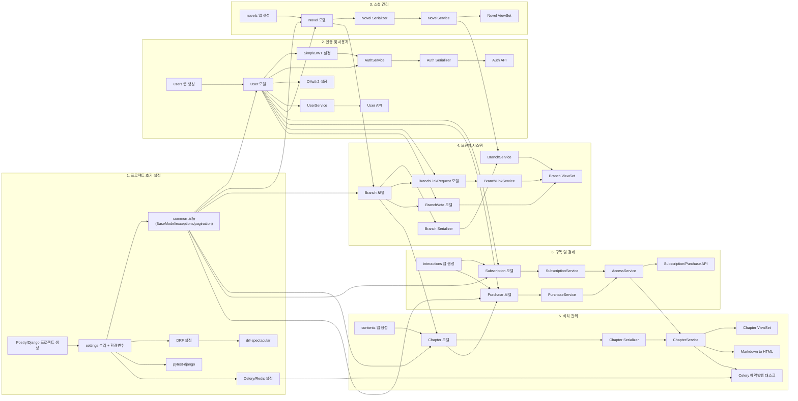

# ForkLore 백엔드 PERT 차트 (P0 태스크)

이 문서는 백엔드 P0 (MVP 필수) 태스크들 간의 종속성을 시각화한 PERT 차트입니다.  
AI 에이전트는 이 차트를 참조하여 **선행 작업이 완료된 태스크**를 다음 작업으로 선정해야 합니다.

## 작업 순서 가이드

1. **Setup**: 프로젝트 생성 → settings → common/DRF/pytest/Celery
2. **Auth**: users 앱 → User 모델 → JWT/AuthService/OAuth2 → Auth API
3. **Novel**: novels 앱 → Novel 모델 → Serializer → Service → ViewSet
4. **Branch**: Branch 모델 → LinkRequest/Vote → Service → ViewSet
5. **Chapter**: contents 앱 → Chapter 모델 → Service(+AccessService) → ViewSet
6. **Subscription**: interactions 앱 → Sub/Purchase 모델 → Service → AccessService → API

## 주요 종속성 설명

| 종속성 | 이유 |
|--------|------|
| `Common → 모든 모델` | BaseModel 상속 |
| `UserModel → NovelModel` | `novels.author_id` FK |
| `NovelModel → BranchModel` | `branches.novel_id` FK |
| `BranchModel → ChapterModel` | `chapters.branch_id` FK |
| `ChapterModel → PurchaseModel` | `purchases.chapter_id` FK |
| `UserModel → SubModel/PurchaseModel` | `user_id` FK |
| `NovelSvc → BranchSvc` | Novel 생성 시 메인 브랜치 자동 생성 |
| `AccessSvc → ChapterSvc` | Chapter.retrieve()가 열람 권한 검사 호출 |
| `CeleryConfig → Scheduler` | 예약 발행 태스크 선행 조건 |
