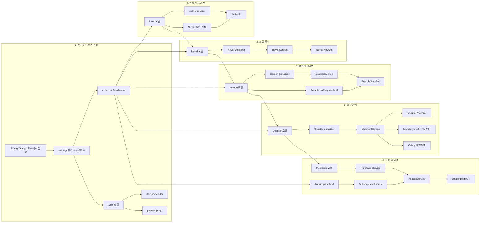

# ForkLore 백엔드 PERT 차트 (P0 태스크)

이 문서는 백엔드 P0 (MVP 필수) 태스크들 간의 종속성을 시각화한 PERT 차트입니다.  
AI 에이전트는 이 차트를 참조하여 **선행 작업이 완료된 태스크**를 다음 작업으로 선정해야 합니다.

## 작업 순서 가이드

1. **Setup 단계**: 프로젝트 생성 → 설정/공통 모듈/DRF/테스트 인프라
2. **Auth 단계**: User/JWT → Auth API
3. **Novel 단계**: Novel → Service → ViewSet
4. **Branch 단계**: Branch/LinkRequest → Service → ViewSet
5. **Chapter 단계**: Chapter → 렌더링/예약발행 → ViewSet
6. **Sub 단계**: Subscription/Purchase → AccessService → API
