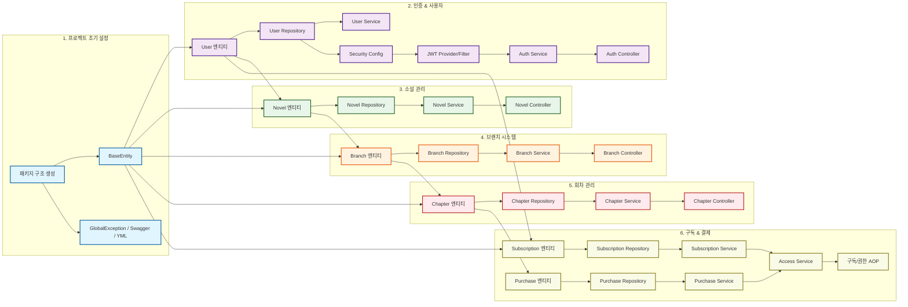

# 📊 ForkLore 백엔드 PERT 차트 (P0 태스크)

이 문서는 백엔드 P0 (MVP 필수) 태스크들 간의 종속성을 시각화한 PERT 차트입니다.
AI 에이전트는 이 차트를 참조하여 **선행 작업이 완료된 태스크**를 다음 작업으로 선정해야 합니다.

## 📋 작업 순서 가이드

1. **Setup 단계**: `패키지 구조` -> `BaseEntity` 및 설정 파일들
2. **Auth 단계**: `User Entity` -> `Repository` -> `Security/JWT` -> `Auth Service`
3. **Novel 단계**: `Novel Entity` -> `Repository` -> `Service`
4. **Branch 단계**: `Branch Entity` -> `Repository` -> `Service`
5. **Chapter 단계**: `Chapter Entity` -> `Repository` -> `Service`
6. **Sub/Pay 단계**: `Entity` -> `Repo` -> `Service` -> `Access Control`
