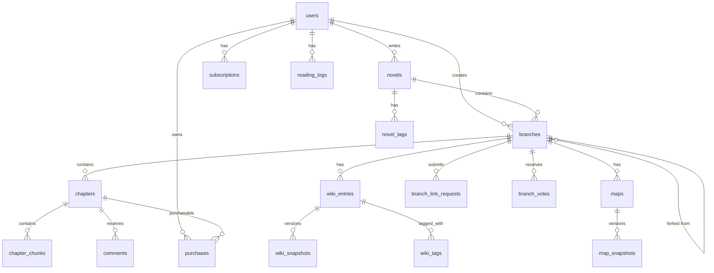

# 🗄️ ForkLore 데이터베이스 스키마 설계 (v4)

**작성일**: 2026.01.02  
**작성자**: HueyJeong (with Gemini)  
**문서 버전**: v4.0 (브랜치 통합 최종)  
**DBMS**: PostgreSQL 18

---

## 1. 개요

### 1.1 v4 핵심 설계

```
┌─────────────────────────────────────────────────────────────────┐
│                         Novel (소설)                            │
│  - 메타 정보 컨테이너 (제목, 장르, 연령등급)                     │
│  - 브랜치 작성 허용 여부 설정                                   │
└─────────────────────────────────────────────────────────────────┘
                              │
                              │ 1:N
                              ▼
┌─────────────────────────────────────────────────────────────────┐
│                        Branch (브랜치)                          │
│  - 메인 브랜치 (is_main = true): 원작 정사                      │
│  - 파생 브랜치 (is_main = false): 외전/팬픽/IF                  │
│  - 모든 콘텐츠(회차, 위키, 지도)는 브랜치에 귀속                │
└─────────────────────────────────────────────────────────────────┘
                              │
           ┌──────────────────┼──────────────────┐
           ▼                  ▼                  ▼
      Chapter            WikiEntry              Map
```

### 1.2 v4 변경사항

| 변경 | 설명 |
|------|------|
| **메인도 브랜치** | 메인 스토리도 `is_main=true` 브랜치로 관리 |
| **테이블 통합** | `chapters`, `wiki_entries`, `maps` 모두 `branch_id` 참조 |
| **중복 제거** | `branch_chapters`, `branch_wiki_entries`, `branch_maps` 삭제 |
| **content_html** | 렌더링 캐시로 유지 |

---

## 2. ERD



---

## 3. 테이블 정의

### 3.1 users

```sql
CREATE TABLE users (
    id                  BIGSERIAL PRIMARY KEY,
    email               VARCHAR(255) NOT NULL UNIQUE,
    password_hash       VARCHAR(255),
    nickname            VARCHAR(50) NOT NULL UNIQUE,
    profile_image_url   VARCHAR(500),
    bio                 TEXT,
    birth_date          DATE,
    
    role                VARCHAR(20) NOT NULL DEFAULT 'READER',
    auth_provider       VARCHAR(20) NOT NULL DEFAULT 'LOCAL',
    provider_id         VARCHAR(255),
    
    mileage             INTEGER NOT NULL DEFAULT 0,
    coin                INTEGER NOT NULL DEFAULT 0,
    email_verified      BOOLEAN NOT NULL DEFAULT FALSE,
    
    created_at          TIMESTAMP NOT NULL DEFAULT CURRENT_TIMESTAMP,
    updated_at          TIMESTAMP NOT NULL DEFAULT CURRENT_TIMESTAMP,
    deleted_at          TIMESTAMP
);
```

### 3.2 novels

```sql
CREATE TABLE novels (
    id              BIGSERIAL PRIMARY KEY,
    author_id       BIGINT NOT NULL REFERENCES users(id),
    
    title           VARCHAR(200) NOT NULL,
    description     TEXT,
    cover_image_url VARCHAR(500),
    
    genre           VARCHAR(50) NOT NULL,
    age_rating      VARCHAR(10) NOT NULL DEFAULT 'ALL',
    status          VARCHAR(20) NOT NULL DEFAULT 'ONGOING',
    
    allow_branching BOOLEAN NOT NULL DEFAULT TRUE,
    
    -- 집계 (캐시)
    total_view_count    BIGINT NOT NULL DEFAULT 0,
    total_like_count    BIGINT NOT NULL DEFAULT 0,
    total_chapter_count INTEGER NOT NULL DEFAULT 0,
    branch_count        INTEGER NOT NULL DEFAULT 1,
    
    created_at      TIMESTAMP NOT NULL DEFAULT CURRENT_TIMESTAMP,
    updated_at      TIMESTAMP NOT NULL DEFAULT CURRENT_TIMESTAMP,
    deleted_at      TIMESTAMP
);
```

### 3.3 branches

```sql
CREATE TABLE branches (
    id                  BIGSERIAL PRIMARY KEY,
    novel_id            BIGINT NOT NULL REFERENCES novels(id) ON DELETE CASCADE,
    author_id           BIGINT NOT NULL REFERENCES users(id),
    
    -- 메인 브랜치 여부 (소설당 하나만 is_main=true)
    is_main             BOOLEAN NOT NULL DEFAULT FALSE,
    
    -- 파생 시 부모 브랜치 + 분기점
    parent_branch_id    BIGINT REFERENCES branches(id),
    fork_point_chapter  INTEGER,
    
    name                VARCHAR(200) NOT NULL,
    description         TEXT,
    cover_image_url     VARCHAR(500),
    
    -- 브랜치 타입: MAIN (원작), SIDE_STORY (외전), FAN_FIC (팬픽), IF_STORY (IF)
    branch_type         VARCHAR(20) NOT NULL DEFAULT 'FAN_FIC',
    
    -- 공개 상태: PRIVATE, PUBLIC, LINKED (작가 승인 후 작품에 노출)
    visibility          VARCHAR(20) NOT NULL DEFAULT 'PRIVATE',
    
    -- 정사 편입: NON_CANON, CANDIDATE, MERGED
    canon_status        VARCHAR(20) NOT NULL DEFAULT 'NON_CANON',
    merged_at_chapter   INTEGER,
    
    vote_count          BIGINT NOT NULL DEFAULT 0,
    vote_threshold      INTEGER NOT NULL DEFAULT 1000,
    view_count          BIGINT NOT NULL DEFAULT 0,
    chapter_count       INTEGER NOT NULL DEFAULT 0,
    
    created_at          TIMESTAMP NOT NULL DEFAULT CURRENT_TIMESTAMP,
    updated_at          TIMESTAMP NOT NULL DEFAULT CURRENT_TIMESTAMP,
    deleted_at          TIMESTAMP
);

-- 소설당 메인 브랜치 하나만
CREATE UNIQUE INDEX idx_branches_main ON branches(novel_id) WHERE is_main = TRUE;
```

### 3.4 chapters (통합)

```sql
CREATE TABLE chapters (
    id              BIGSERIAL PRIMARY KEY,
    branch_id       BIGINT NOT NULL REFERENCES branches(id) ON DELETE CASCADE,
    
    chapter_number  INTEGER NOT NULL,
    title           VARCHAR(200) NOT NULL,
    content         TEXT NOT NULL,           -- 마크다운 원본
    content_html    TEXT,                    -- 렌더링 캐시
    word_count      INTEGER NOT NULL DEFAULT 0,
    
    status          VARCHAR(20) NOT NULL DEFAULT 'DRAFT',
    scheduled_at    TIMESTAMP,
    published_at    TIMESTAMP,
    
    access_type     VARCHAR(20) NOT NULL DEFAULT 'FREE',
    price           INTEGER NOT NULL DEFAULT 0,
    
    view_count      BIGINT NOT NULL DEFAULT 0,
    like_count      BIGINT NOT NULL DEFAULT 0,
    comment_count   INTEGER NOT NULL DEFAULT 0,
    
    created_at      TIMESTAMP NOT NULL DEFAULT CURRENT_TIMESTAMP,
    updated_at      TIMESTAMP NOT NULL DEFAULT CURRENT_TIMESTAMP,
    
    UNIQUE (branch_id, chapter_number)
);
```

### 3.5 wiki_entries (브랜치 귀속)

```sql
CREATE TABLE wiki_entries (
    id                  BIGSERIAL PRIMARY KEY,
    branch_id           BIGINT NOT NULL REFERENCES branches(id) ON DELETE CASCADE,
    
    -- 원작 위키에서 포크한 경우
    source_wiki_id      BIGINT REFERENCES wiki_entries(id),
    
    name                VARCHAR(200) NOT NULL,
    image_url           VARCHAR(500),
    first_appearance    INTEGER,
    hidden_note         TEXT,
    ai_metadata         JSONB,
    
    created_at          TIMESTAMP NOT NULL DEFAULT CURRENT_TIMESTAMP,
    updated_at          TIMESTAMP NOT NULL DEFAULT CURRENT_TIMESTAMP,
    
    UNIQUE (branch_id, name)
);
```

### 3.6 wiki_tag_definitions

```sql
CREATE TABLE wiki_tag_definitions (
    id          BIGSERIAL PRIMARY KEY,
    branch_id   BIGINT NOT NULL REFERENCES branches(id) ON DELETE CASCADE,
    name        VARCHAR(100) NOT NULL,
    color       VARCHAR(7),
    icon        VARCHAR(50),
    description TEXT,
    display_order INTEGER NOT NULL DEFAULT 0,
    created_at  TIMESTAMP NOT NULL DEFAULT CURRENT_TIMESTAMP,
    UNIQUE (branch_id, name)
);

CREATE TABLE wiki_tags (
    wiki_entry_id BIGINT NOT NULL REFERENCES wiki_entries(id) ON DELETE CASCADE,
    tag_id        BIGINT NOT NULL REFERENCES wiki_tag_definitions(id) ON DELETE CASCADE,
    PRIMARY KEY (wiki_entry_id, tag_id)
);
```

### 3.7 wiki_snapshots

```sql
CREATE TABLE wiki_snapshots (
    id                  BIGSERIAL PRIMARY KEY,
    wiki_entry_id       BIGINT NOT NULL REFERENCES wiki_entries(id) ON DELETE CASCADE,
    content             TEXT NOT NULL,
    valid_from_chapter  INTEGER NOT NULL,
    contributor_type    VARCHAR(10) NOT NULL DEFAULT 'USER',
    contributor_id      BIGINT REFERENCES users(id),
    created_at          TIMESTAMP NOT NULL DEFAULT CURRENT_TIMESTAMP,
    UNIQUE (wiki_entry_id, valid_from_chapter)
);
```

### 3.8 maps (브랜치 귀속)

```sql
CREATE TABLE maps (
    id              BIGSERIAL PRIMARY KEY,
    branch_id       BIGINT NOT NULL REFERENCES branches(id) ON DELETE CASCADE,
    
    source_map_id   BIGINT REFERENCES maps(id),
    
    name            VARCHAR(100) NOT NULL,
    description     TEXT,
    width           INTEGER NOT NULL,
    height          INTEGER NOT NULL,
    
    created_at      TIMESTAMP NOT NULL DEFAULT CURRENT_TIMESTAMP,
    updated_at      TIMESTAMP NOT NULL DEFAULT CURRENT_TIMESTAMP,
    
    UNIQUE (branch_id, name)
);

CREATE TABLE map_snapshots (
    id                  BIGSERIAL PRIMARY KEY,
    map_id              BIGINT NOT NULL REFERENCES maps(id) ON DELETE CASCADE,
    valid_from_chapter  INTEGER NOT NULL,
    base_image_url      VARCHAR(500),
    created_at          TIMESTAMP NOT NULL DEFAULT CURRENT_TIMESTAMP,
    UNIQUE (map_id, valid_from_chapter)
);

CREATE TABLE map_layers (
    id          BIGSERIAL PRIMARY KEY,
    snapshot_id BIGINT NOT NULL REFERENCES map_snapshots(id) ON DELETE CASCADE,
    name        VARCHAR(100) NOT NULL,
    layer_type  VARCHAR(50) NOT NULL,
    z_index     INTEGER NOT NULL DEFAULT 0,
    is_visible  BOOLEAN NOT NULL DEFAULT TRUE,
    style_json  JSONB,
    created_at  TIMESTAMP NOT NULL DEFAULT CURRENT_TIMESTAMP
);

CREATE TABLE map_objects (
    id            BIGSERIAL PRIMARY KEY,
    layer_id      BIGINT NOT NULL REFERENCES map_layers(id) ON DELETE CASCADE,
    object_type   VARCHAR(50) NOT NULL,
    coordinates   JSONB NOT NULL,
    label         VARCHAR(100),
    description   TEXT,
    wiki_entry_id BIGINT REFERENCES wiki_entries(id),
    style_json    JSONB,
    created_at    TIMESTAMP NOT NULL DEFAULT CURRENT_TIMESTAMP
);
```

### 3.9 chapter_chunks (Gemini Embedding)

```sql
CREATE EXTENSION IF NOT EXISTS vector;

CREATE TABLE chapter_chunks (
    id          BIGSERIAL PRIMARY KEY,
    chapter_id  BIGINT NOT NULL REFERENCES chapters(id) ON DELETE CASCADE,
    chunk_index INTEGER NOT NULL,
    content     TEXT NOT NULL,
    embedding   vector(3072),  -- Gemini Embedding 001 기본
    created_at  TIMESTAMP NOT NULL DEFAULT CURRENT_TIMESTAMP,
    UNIQUE (chapter_id, chunk_index)
);

CREATE INDEX idx_chunks_embedding ON chapter_chunks 
    USING ivfflat (embedding vector_cosine_ops) WITH (lists = 100);
```

### 3.10 subscriptions & purchases

```sql
CREATE TABLE subscriptions (
    id          BIGSERIAL PRIMARY KEY,
    user_id     BIGINT NOT NULL REFERENCES users(id) ON DELETE CASCADE,
    plan_type   VARCHAR(20) NOT NULL,
    started_at  TIMESTAMP NOT NULL DEFAULT CURRENT_TIMESTAMP,
    expires_at  TIMESTAMP NOT NULL,
    payment_id  VARCHAR(255),
    auto_renew  BOOLEAN NOT NULL DEFAULT TRUE,
    status      VARCHAR(20) NOT NULL DEFAULT 'ACTIVE',
    cancelled_at TIMESTAMP,
    created_at   TIMESTAMP NOT NULL DEFAULT CURRENT_TIMESTAMP,
    updated_at   TIMESTAMP NOT NULL DEFAULT CURRENT_TIMESTAMP
);

CREATE TABLE purchases (
    id          BIGSERIAL PRIMARY KEY,
    user_id     BIGINT NOT NULL REFERENCES users(id) ON DELETE CASCADE,
    chapter_id  BIGINT NOT NULL REFERENCES chapters(id) ON DELETE CASCADE,
    price_paid  INTEGER NOT NULL,
    purchased_at TIMESTAMP NOT NULL DEFAULT CURRENT_TIMESTAMP,
    UNIQUE (user_id, chapter_id)
);
```

### 3.11 branch_link_requests

```sql
CREATE TABLE branch_link_requests (
    id              BIGSERIAL PRIMARY KEY,
    branch_id       BIGINT NOT NULL REFERENCES branches(id) ON DELETE CASCADE,
    status          VARCHAR(20) NOT NULL DEFAULT 'PENDING',
    request_message TEXT,
    reviewer_id     BIGINT REFERENCES users(id),
    review_comment  TEXT,
    reviewed_at     TIMESTAMP,
    created_at      TIMESTAMP NOT NULL DEFAULT CURRENT_TIMESTAMP
);
```

### 3.12 reading_logs, bookmarks, likes, comments, branch_votes

```sql
CREATE TABLE reading_logs (
    id           BIGSERIAL PRIMARY KEY,
    user_id      BIGINT NOT NULL REFERENCES users(id) ON DELETE CASCADE,
    chapter_id   BIGINT NOT NULL REFERENCES chapters(id) ON DELETE CASCADE,
    progress     DECIMAL(5,4) NOT NULL DEFAULT 0,
    is_completed BOOLEAN NOT NULL DEFAULT FALSE,
    read_at      TIMESTAMP NOT NULL DEFAULT CURRENT_TIMESTAMP,
    updated_at   TIMESTAMP NOT NULL DEFAULT CURRENT_TIMESTAMP,
    deleted_at   TIMESTAMP,
    UNIQUE (user_id, chapter_id)
);

CREATE TABLE bookmarks (
    id              BIGSERIAL PRIMARY KEY,
    user_id         BIGINT NOT NULL REFERENCES users(id) ON DELETE CASCADE,
    chapter_id      BIGINT NOT NULL REFERENCES chapters(id) ON DELETE CASCADE,
    scroll_position DECIMAL(5,4) NOT NULL DEFAULT 0,
    note            VARCHAR(500),
    created_at      TIMESTAMP NOT NULL DEFAULT CURRENT_TIMESTAMP,
    UNIQUE (user_id, chapter_id)
);

CREATE TABLE likes (
    id          BIGSERIAL PRIMARY KEY,
    user_id     BIGINT NOT NULL REFERENCES users(id) ON DELETE CASCADE,
    target_type VARCHAR(20) NOT NULL,
    target_id   BIGINT NOT NULL,
    created_at  TIMESTAMP NOT NULL DEFAULT CURRENT_TIMESTAMP,
    UNIQUE (user_id, target_type, target_id)
);

CREATE TABLE comments (
    id          BIGSERIAL PRIMARY KEY,
    user_id     BIGINT NOT NULL REFERENCES users(id),
    chapter_id  BIGINT NOT NULL REFERENCES chapters(id) ON DELETE CASCADE,
    parent_id   BIGINT REFERENCES comments(id) ON DELETE CASCADE,
    content     TEXT NOT NULL,
    is_spoiler  BOOLEAN NOT NULL DEFAULT FALSE,
    is_pinned   BOOLEAN NOT NULL DEFAULT FALSE,
    like_count  INTEGER NOT NULL DEFAULT 0,
    created_at  TIMESTAMP NOT NULL DEFAULT CURRENT_TIMESTAMP,
    updated_at  TIMESTAMP NOT NULL DEFAULT CURRENT_TIMESTAMP,
    deleted_at  TIMESTAMP
);

CREATE TABLE branch_votes (
    user_id    BIGINT NOT NULL REFERENCES users(id) ON DELETE CASCADE,
    branch_id  BIGINT NOT NULL REFERENCES branches(id) ON DELETE CASCADE,
    created_at TIMESTAMP NOT NULL DEFAULT CURRENT_TIMESTAMP,
    PRIMARY KEY (user_id, branch_id)
);
```

---

## 4. 접근 제어 정책

### 열람 권한

| 조건 | 열람 |
|------|------|
| access_type = FREE | ✅ |
| SUBSCRIPTION + 구독 중 | ✅ |
| SUBSCRIPTION + 소장 | ✅ |
| SUBSCRIPTION + 미구독/미소장 | ❌ |

### 브랜치 접근

| visibility | 작성자 | 원작 작가 | 일반 |
|------------|--------|----------|------|
| PRIVATE | ✅ | ❌ | ❌ |
| PUBLIC | ✅ | ✅ | ✅ (검색/URL) |
| LINKED | ✅ | ✅ | ✅ (작품 페이지) |

---

## 문서 끝
