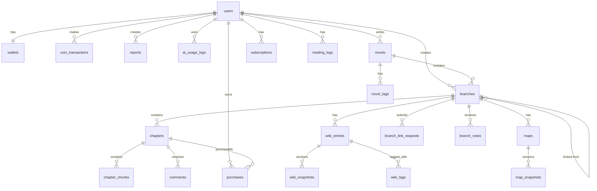

# 🗄️ ForkLore 데이터베이스 스키마 설계 (v4.1)

**작성일**: 2026.01.13  
**작성자**: HueyJeong (with AI)  
**문서 버전**: v4.1 (브랜치 통합 + 커뮤니티/신고/코인/AI 한도 보강)  
**DBMS**: PostgreSQL 18 (+ pgvector)

---

## 1. 개요

### 1.1 v4 핵심 설계

```
┌─────────────────────────────────────────────────────────────────┐
│                         Novel (소설)                            │
│  - 메타 정보 컨테이너 (제목, 장르, 연령등급)                     │
│  - 브랜치 작성 허용 여부 설정                                   │
└─────────────────────────────────────────────────────────────────┘
                              │
                              │ 1:N
                              ▼
┌─────────────────────────────────────────────────────────────────┐
│                        Branch (브랜치)                          │
│  - 메인 브랜치 (is_main = true): 원작 정사                      │
│  - 파생 브랜치 (is_main = false): 외전/팬픽/IF                  │
│  - 모든 콘텐츠(회차, 위키, 지도)는 브랜치에 귀속                │
└─────────────────────────────────────────────────────────────────┘
                              │
           ┌──────────────────┼──────────────────┐
           ▼                  ▼                  ▼
      Chapter            WikiEntry              Map
```

### 1.2 v4.1 변경사항

| 변경 | 설명 |
|------|------|
| **Paragraph Comment 지원** | `comments`에 문단/선택영역(anchor) 필드 추가 |
| **Report(신고) 추가** | 스포일러/악성 행위 신고를 위한 `reports` 추가 |
| **코인 원장(ledger) 추가** | `wallets`, `coin_transactions`로 감사 가능/불변 원장 |
| **AI 일일 한도 추적** | `ai_usage_logs`로 날짜별 사용량 추적 |
| **linkedBranchCount 정합성** | `novels.linked_branch_count` 캐시 필드 추가 |

---

## 2. ERD



---

## 3. 테이블 정의

### 3.1 users

```sql
CREATE TABLE users (
    id                  BIGSERIAL PRIMARY KEY,
    email               VARCHAR(255) NOT NULL UNIQUE,
    password_hash       VARCHAR(255),
    nickname            VARCHAR(50) NOT NULL UNIQUE,
    profile_image_url   VARCHAR(500),
    bio                 TEXT,
    birth_date          DATE,

    role                VARCHAR(20) NOT NULL DEFAULT 'READER',
    auth_provider       VARCHAR(20) NOT NULL DEFAULT 'LOCAL',
    provider_id         VARCHAR(255),

    -- NOTE: v4.1부터 코인/마일리지는 wallets가 SSOT(단일 진실) 권장.
    -- users.coin/mileage는 마이그레이션/호환 목적의 레거시로 유지 가능.
    mileage             INTEGER NOT NULL DEFAULT 0,
    coin                INTEGER NOT NULL DEFAULT 0,

    email_verified      BOOLEAN NOT NULL DEFAULT FALSE,

    created_at          TIMESTAMP NOT NULL DEFAULT CURRENT_TIMESTAMP,
    updated_at          TIMESTAMP NOT NULL DEFAULT CURRENT_TIMESTAMP,
    deleted_at          TIMESTAMP
);
```

### 3.2 wallets (코인/마일리지 지갑)

- 사용자당 1개 (1:1)
- 잔액은 변경될 수 있으나, **모든 변화는 `coin_transactions`에 기록**한다.

```sql
CREATE TABLE wallets (
    id              BIGSERIAL PRIMARY KEY,
    user_id         BIGINT NOT NULL UNIQUE REFERENCES users(id) ON DELETE CASCADE,

    coin_balance    INTEGER NOT NULL DEFAULT 0,
    mileage_balance INTEGER NOT NULL DEFAULT 0,

    created_at      TIMESTAMP NOT NULL DEFAULT CURRENT_TIMESTAMP,
    updated_at      TIMESTAMP NOT NULL DEFAULT CURRENT_TIMESTAMP
);

CREATE INDEX idx_wallets_user ON wallets(user_id);
```

### 3.3 coin_transactions (코인 원장)

- 원장(ledger)은 **삭제/수정하지 않는다** (정정은 반대 부호의 거래로 처리)
- `amount`는 +면 적립/충전, -면 사용/차감

```sql
CREATE TABLE coin_transactions (
    id                  BIGSERIAL PRIMARY KEY,
    user_id             BIGINT NOT NULL REFERENCES users(id) ON DELETE CASCADE,
    wallet_id           BIGINT REFERENCES wallets(id) ON DELETE SET NULL,

    transaction_type    VARCHAR(30) NOT NULL,
    -- 예: CHARGE, PURCHASE, REFUND, REWARD, ADJUSTMENT

    amount              INTEGER NOT NULL,
    balance_after       INTEGER NOT NULL,

    reference_type      VARCHAR(30),
    reference_id        BIGINT,

    description         TEXT,

    created_at          TIMESTAMP NOT NULL DEFAULT CURRENT_TIMESTAMP
);

CREATE INDEX idx_coin_tx_user_created ON coin_transactions(user_id, created_at DESC);
CREATE INDEX idx_coin_tx_reference ON coin_transactions(reference_type, reference_id);
```

### 3.4 novels

```sql
CREATE TABLE novels (
    id              BIGSERIAL PRIMARY KEY,
    author_id       BIGINT NOT NULL REFERENCES users(id),

    title           VARCHAR(200) NOT NULL,
    description     TEXT,
    cover_image_url VARCHAR(500),

    genre           VARCHAR(50) NOT NULL,
    age_rating      VARCHAR(10) NOT NULL DEFAULT 'ALL',
    status          VARCHAR(20) NOT NULL DEFAULT 'ONGOING',

    allow_branching BOOLEAN NOT NULL DEFAULT TRUE,

    -- 집계 (캐시)
    total_view_count      BIGINT NOT NULL DEFAULT 0,
    total_like_count      BIGINT NOT NULL DEFAULT 0,
    total_chapter_count   INTEGER NOT NULL DEFAULT 0,
    branch_count          INTEGER NOT NULL DEFAULT 1,
    linked_branch_count   INTEGER NOT NULL DEFAULT 0, -- visibility=LINKED 브랜치 수 (캐시)

    created_at      TIMESTAMP NOT NULL DEFAULT CURRENT_TIMESTAMP,
    updated_at      TIMESTAMP NOT NULL DEFAULT CURRENT_TIMESTAMP,
    deleted_at      TIMESTAMP
);

CREATE INDEX idx_novels_genre ON novels(genre);
CREATE INDEX idx_novels_status ON novels(status);
```

### 3.5 branches

```sql
CREATE TABLE branches (
    id                  BIGSERIAL PRIMARY KEY,
    novel_id            BIGINT NOT NULL REFERENCES novels(id) ON DELETE CASCADE,
    author_id           BIGINT NOT NULL REFERENCES users(id),

    is_main             BOOLEAN NOT NULL DEFAULT FALSE,

    parent_branch_id    BIGINT REFERENCES branches(id),
    fork_point_chapter  INTEGER,

    name                VARCHAR(200) NOT NULL,
    description         TEXT,
    cover_image_url     VARCHAR(500),

    branch_type         VARCHAR(20) NOT NULL DEFAULT 'FAN_FIC',
    visibility          VARCHAR(20) NOT NULL DEFAULT 'PRIVATE',
    canon_status        VARCHAR(20) NOT NULL DEFAULT 'NON_CANON',
    merged_at_chapter   INTEGER,

    vote_count          BIGINT NOT NULL DEFAULT 0,
    vote_threshold      INTEGER NOT NULL DEFAULT 1000,
    view_count          BIGINT NOT NULL DEFAULT 0,
    chapter_count       INTEGER NOT NULL DEFAULT 0,

    created_at          TIMESTAMP NOT NULL DEFAULT CURRENT_TIMESTAMP,
    updated_at          TIMESTAMP NOT NULL DEFAULT CURRENT_TIMESTAMP,
    deleted_at          TIMESTAMP
);

-- 소설당 메인 브랜치 하나만
CREATE UNIQUE INDEX idx_branches_main ON branches(novel_id) WHERE is_main = TRUE;
CREATE INDEX idx_branches_novel_visibility ON branches(novel_id, visibility);
```

### 3.6 chapters (통합)

```sql
CREATE TABLE chapters (
    id              BIGSERIAL PRIMARY KEY,
    branch_id       BIGINT NOT NULL REFERENCES branches(id) ON DELETE CASCADE,

    chapter_number  INTEGER NOT NULL,
    title           VARCHAR(200) NOT NULL,
    content         TEXT NOT NULL,
    content_html    TEXT,
    word_count      INTEGER NOT NULL DEFAULT 0,

    status          VARCHAR(20) NOT NULL DEFAULT 'DRAFT',
    scheduled_at    TIMESTAMP,
    published_at    TIMESTAMP,

    access_type     VARCHAR(20) NOT NULL DEFAULT 'FREE',
    price           INTEGER NOT NULL DEFAULT 0,

    view_count      BIGINT NOT NULL DEFAULT 0,
    like_count      BIGINT NOT NULL DEFAULT 0,
    comment_count   INTEGER NOT NULL DEFAULT 0,

    created_at      TIMESTAMP NOT NULL DEFAULT CURRENT_TIMESTAMP,
    updated_at      TIMESTAMP NOT NULL DEFAULT CURRENT_TIMESTAMP,

    UNIQUE (branch_id, chapter_number)
);

CREATE INDEX idx_chapters_branch_published ON chapters(branch_id, published_at);
```

### 3.7 comments (Paragraph Comment 지원)

- 회차 단위 댓글 + 문단(anchor) 기반 댓글을 동일 테이블에서 처리
- 문단 댓글은 `paragraph_index`가 존재
- 텍스트 선택 댓글은 `selection_start/end`, `quoted_text`를 함께 저장 (본문 변경 시에도 코멘트 컨텍스트 유지)

```sql
CREATE TABLE comments (
    id              BIGSERIAL PRIMARY KEY,
    user_id         BIGINT NOT NULL REFERENCES users(id),
    chapter_id      BIGINT NOT NULL REFERENCES chapters(id) ON DELETE CASCADE,
    parent_id       BIGINT REFERENCES comments(id) ON DELETE CASCADE,

    content         TEXT NOT NULL,

    -- Paragraph Comment anchor (optional)
    paragraph_index INTEGER,
    selection_start INTEGER,
    selection_end   INTEGER,
    quoted_text     TEXT,

    is_spoiler      BOOLEAN NOT NULL DEFAULT FALSE,
    is_pinned       BOOLEAN NOT NULL DEFAULT FALSE,
    like_count      INTEGER NOT NULL DEFAULT 0,

    created_at      TIMESTAMP NOT NULL DEFAULT CURRENT_TIMESTAMP,
    updated_at      TIMESTAMP NOT NULL DEFAULT CURRENT_TIMESTAMP,
    deleted_at      TIMESTAMP
);

-- 조회 최적화
CREATE INDEX idx_comments_chapter_created ON comments(chapter_id, created_at DESC);
CREATE INDEX idx_comments_chapter_paragraph ON comments(chapter_id, paragraph_index)
WHERE paragraph_index IS NOT NULL AND deleted_at IS NULL;

-- 선택영역 무결성 (선택영역이 존재한다면 start < end)
ALTER TABLE comments
ADD CONSTRAINT chk_comments_selection_range
CHECK (
    selection_start IS NULL
    OR selection_end IS NULL
    OR selection_start < selection_end
);
```

### 3.8 reports (신고)

- 스포일러/욕설/스팸 등 신고를 통합 관리
- target은 폴리모픽(`target_type`, `target_id`)으로 관리

```sql
CREATE TABLE reports (
    id              BIGSERIAL PRIMARY KEY,
    reporter_id     BIGINT NOT NULL REFERENCES users(id),

    target_type     VARCHAR(30) NOT NULL, -- NOVEL, BRANCH, CHAPTER, COMMENT, USER ...
    target_id       BIGINT NOT NULL,

    report_type     VARCHAR(30) NOT NULL, -- SPOILER, ABUSE, SPAM, INAPPROPRIATE ...
    message         TEXT,

    status          VARCHAR(20) NOT NULL DEFAULT 'PENDING', -- PENDING, RESOLVED, REJECTED
    resolver_id     BIGINT REFERENCES users(id),
    resolution_note TEXT,
    resolved_at     TIMESTAMP,

    created_at      TIMESTAMP NOT NULL DEFAULT CURRENT_TIMESTAMP,
    updated_at      TIMESTAMP NOT NULL DEFAULT CURRENT_TIMESTAMP,
    deleted_at      TIMESTAMP
);

CREATE INDEX idx_reports_target ON reports(target_type, target_id);
CREATE INDEX idx_reports_status ON reports(status, created_at DESC);
```

### 3.9 ai_usage_logs (AI 일일 한도 추적)

- 날짜/유저/액션 단위로 사용량 집계
- 요청 수/토큰 수(또는 비용)를 기록하여 티어별 일일 제한 적용 가능

```sql
CREATE TABLE ai_usage_logs (
    id              BIGSERIAL PRIMARY KEY,
    user_id         BIGINT NOT NULL REFERENCES users(id) ON DELETE CASCADE,

    usage_date      DATE NOT NULL DEFAULT CURRENT_DATE,
    action_type     VARCHAR(30) NOT NULL, -- ASK, WIKI_SUGGESTION, CONSISTENCY_CHECK ...
    request_count   INTEGER NOT NULL DEFAULT 0,
    token_count     INTEGER NOT NULL DEFAULT 0,

    created_at      TIMESTAMP NOT NULL DEFAULT CURRENT_TIMESTAMP,
    updated_at      TIMESTAMP NOT NULL DEFAULT CURRENT_TIMESTAMP,

    UNIQUE (user_id, usage_date, action_type)
);

CREATE INDEX idx_ai_usage_lookup ON ai_usage_logs(usage_date, user_id);
```

### 3.10 wiki_entries (브랜치 귀속)

```sql
CREATE TABLE wiki_entries (
    id                  BIGSERIAL PRIMARY KEY,
    branch_id           BIGINT NOT NULL REFERENCES branches(id) ON DELETE CASCADE,

    -- 원작 위키에서 포크한 경우
    source_wiki_id      BIGINT REFERENCES wiki_entries(id),

    name                VARCHAR(200) NOT NULL,
    image_url           VARCHAR(500),
    first_appearance    INTEGER,
    hidden_note         TEXT,
    ai_metadata         JSONB,

    created_at          TIMESTAMP NOT NULL DEFAULT CURRENT_TIMESTAMP,
    updated_at          TIMESTAMP NOT NULL DEFAULT CURRENT_TIMESTAMP,

    UNIQUE (branch_id, name)
);
```

### 3.11 wiki_tag_definitions

```sql
CREATE TABLE wiki_tag_definitions (
    id          BIGSERIAL PRIMARY KEY,
    branch_id   BIGINT NOT NULL REFERENCES branches(id) ON DELETE CASCADE,
    name        VARCHAR(100) NOT NULL,
    color       VARCHAR(7),
    icon        VARCHAR(50),
    description TEXT,
    display_order INTEGER NOT NULL DEFAULT 0,
    created_at  TIMESTAMP NOT NULL DEFAULT CURRENT_TIMESTAMP,
    UNIQUE (branch_id, name)
);

CREATE TABLE wiki_tags (
    wiki_entry_id BIGINT NOT NULL REFERENCES wiki_entries(id) ON DELETE CASCADE,
    tag_id        BIGINT NOT NULL REFERENCES wiki_tag_definitions(id) ON DELETE CASCADE,
    PRIMARY KEY (wiki_entry_id, tag_id)
);
```

### 3.12 wiki_snapshots

```sql
CREATE TABLE wiki_snapshots (
    id                  BIGSERIAL PRIMARY KEY,
    wiki_entry_id       BIGINT NOT NULL REFERENCES wiki_entries(id) ON DELETE CASCADE,
    content             TEXT NOT NULL,
    valid_from_chapter  INTEGER NOT NULL,
    contributor_type    VARCHAR(10) NOT NULL DEFAULT 'USER',
    contributor_id      BIGINT REFERENCES users(id),
    created_at          TIMESTAMP NOT NULL DEFAULT CURRENT_TIMESTAMP,
    UNIQUE (wiki_entry_id, valid_from_chapter)
);
```

### 3.13 maps (브랜치 귀속)

```sql
CREATE TABLE maps (
    id              BIGSERIAL PRIMARY KEY,
    branch_id       BIGINT NOT NULL REFERENCES branches(id) ON DELETE CASCADE,

    source_map_id   BIGINT REFERENCES maps(id),

    name            VARCHAR(100) NOT NULL,
    description     TEXT,
    width           INTEGER NOT NULL,
    height          INTEGER NOT NULL,

    created_at      TIMESTAMP NOT NULL DEFAULT CURRENT_TIMESTAMP,
    updated_at      TIMESTAMP NOT NULL DEFAULT CURRENT_TIMESTAMP,

    UNIQUE (branch_id, name)
);

CREATE TABLE map_snapshots (
    id                  BIGSERIAL PRIMARY KEY,
    map_id              BIGINT NOT NULL REFERENCES maps(id) ON DELETE CASCADE,
    valid_from_chapter  INTEGER NOT NULL,
    base_image_url      VARCHAR(500),
    created_at          TIMESTAMP NOT NULL DEFAULT CURRENT_TIMESTAMP,
    UNIQUE (map_id, valid_from_chapter)
);

CREATE TABLE map_layers (
    id          BIGSERIAL PRIMARY KEY,
    snapshot_id BIGINT NOT NULL REFERENCES map_snapshots(id) ON DELETE CASCADE,
    name        VARCHAR(100) NOT NULL,
    layer_type  VARCHAR(50) NOT NULL,
    z_index     INTEGER NOT NULL DEFAULT 0,
    is_visible  BOOLEAN NOT NULL DEFAULT TRUE,
    style_json  JSONB,
    created_at  TIMESTAMP NOT NULL DEFAULT CURRENT_TIMESTAMP
);

CREATE TABLE map_objects (
    id            BIGSERIAL PRIMARY KEY,
    layer_id      BIGINT NOT NULL REFERENCES map_layers(id) ON DELETE CASCADE,
    object_type   VARCHAR(50) NOT NULL,
    coordinates   JSONB NOT NULL,
    label         VARCHAR(100),
    description   TEXT,
    wiki_entry_id BIGINT REFERENCES wiki_entries(id),
    style_json    JSONB,
    created_at    TIMESTAMP NOT NULL DEFAULT CURRENT_TIMESTAMP
);
```

### 3.14 chapter_chunks (Gemini Embedding)

```sql
CREATE EXTENSION IF NOT EXISTS vector;

CREATE TABLE chapter_chunks (
    id          BIGSERIAL PRIMARY KEY,
    chapter_id  BIGINT NOT NULL REFERENCES chapters(id) ON DELETE CASCADE,
    chunk_index INTEGER NOT NULL,
    content     TEXT NOT NULL,
    embedding   vector(3072),  -- Gemini Embedding 001 기본
    created_at  TIMESTAMP NOT NULL DEFAULT CURRENT_TIMESTAMP,
    UNIQUE (chapter_id, chunk_index)
);

CREATE INDEX idx_chunks_embedding ON chapter_chunks 
    USING ivfflat (embedding vector_cosine_ops) WITH (lists = 100);
```

### 3.15 subscriptions & purchases

```sql
CREATE TABLE subscriptions (
    id          BIGSERIAL PRIMARY KEY,
    user_id     BIGINT NOT NULL REFERENCES users(id) ON DELETE CASCADE,
    plan_type   VARCHAR(20) NOT NULL,
    started_at  TIMESTAMP NOT NULL DEFAULT CURRENT_TIMESTAMP,
    expires_at  TIMESTAMP NOT NULL,
    payment_id  VARCHAR(255),
    auto_renew  BOOLEAN NOT NULL DEFAULT TRUE,
    status      VARCHAR(20) NOT NULL DEFAULT 'ACTIVE',
    cancelled_at TIMESTAMP,
    created_at   TIMESTAMP NOT NULL DEFAULT CURRENT_TIMESTAMP,
    updated_at   TIMESTAMP NOT NULL DEFAULT CURRENT_TIMESTAMP
);

CREATE TABLE purchases (
    id          BIGSERIAL PRIMARY KEY,
    user_id     BIGINT NOT NULL REFERENCES users(id) ON DELETE CASCADE,
    chapter_id  BIGINT NOT NULL REFERENCES chapters(id) ON DELETE CASCADE,
    price_paid  INTEGER NOT NULL,
    purchased_at TIMESTAMP NOT NULL DEFAULT CURRENT_TIMESTAMP,
    UNIQUE (user_id, chapter_id)
);
```

### 3.16 branch_link_requests

```sql
CREATE TABLE branch_link_requests (
    id              BIGSERIAL PRIMARY KEY,
    branch_id       BIGINT NOT NULL REFERENCES branches(id) ON DELETE CASCADE,
    status          VARCHAR(20) NOT NULL DEFAULT 'PENDING',
    request_message TEXT,
    reviewer_id     BIGINT REFERENCES users(id),
    review_comment  TEXT,
    reviewed_at     TIMESTAMP,
    created_at      TIMESTAMP NOT NULL DEFAULT CURRENT_TIMESTAMP
);
```

### 3.17 reading_logs, bookmarks, likes, branch_votes

```sql
CREATE TABLE reading_logs (
    id           BIGSERIAL PRIMARY KEY,
    user_id      BIGINT NOT NULL REFERENCES users(id) ON DELETE CASCADE,
    chapter_id   BIGINT NOT NULL REFERENCES chapters(id) ON DELETE CASCADE,
    progress     DECIMAL(5,4) NOT NULL DEFAULT 0,
    is_completed BOOLEAN NOT NULL DEFAULT FALSE,
    read_at      TIMESTAMP NOT NULL DEFAULT CURRENT_TIMESTAMP,
    updated_at   TIMESTAMP NOT NULL DEFAULT CURRENT_TIMESTAMP,
    deleted_at   TIMESTAMP,
    UNIQUE (user_id, chapter_id)
);

CREATE TABLE bookmarks (
    id              BIGSERIAL PRIMARY KEY,
    user_id         BIGINT NOT NULL REFERENCES users(id) ON DELETE CASCADE,
    chapter_id      BIGINT NOT NULL REFERENCES chapters(id) ON DELETE CASCADE,
    scroll_position DECIMAL(5,4) NOT NULL DEFAULT 0,
    note            VARCHAR(500),
    created_at      TIMESTAMP NOT NULL DEFAULT CURRENT_TIMESTAMP,
    UNIQUE (user_id, chapter_id)
);

CREATE TABLE likes (
    id          BIGSERIAL PRIMARY KEY,
    user_id     BIGINT NOT NULL REFERENCES users(id) ON DELETE CASCADE,
    target_type VARCHAR(20) NOT NULL,
    target_id   BIGINT NOT NULL,
    created_at  TIMESTAMP NOT NULL DEFAULT CURRENT_TIMESTAMP,
    UNIQUE (user_id, target_type, target_id)
);

CREATE TABLE branch_votes (
    user_id    BIGINT NOT NULL REFERENCES users(id) ON DELETE CASCADE,
    branch_id  BIGINT NOT NULL REFERENCES branches(id) ON DELETE CASCADE,
    created_at TIMESTAMP NOT NULL DEFAULT CURRENT_TIMESTAMP,
    PRIMARY KEY (user_id, branch_id)
);
```

---

## 4. 접근 제어 정책

### 열람 권한

| 조건 | 열람 |
|------|------|
| access_type = FREE | ✅ |
| SUBSCRIPTION + 구독 중 | ✅ |
| SUBSCRIPTION + 소장 | ✅ |
| SUBSCRIPTION + 미구독/미소장 | ❌ |

### 브랜치 접근

| visibility | 작성자 | 원작 작가 | 일반 |
|------------|--------|----------|------|
| PRIVATE | ✅ | ❌ | ❌ |
| PUBLIC | ✅ | ✅ | ✅ (검색/URL) |
| LINKED | ✅ | ✅ | ✅ (작품 페이지) |

---

## 문서 끝
