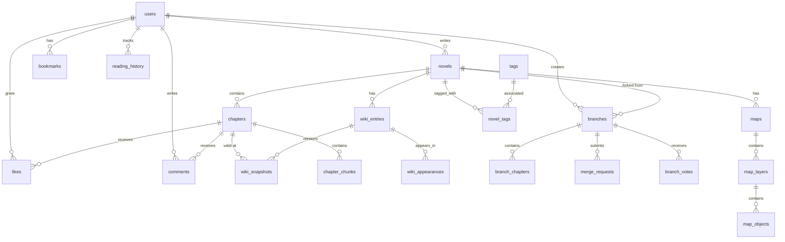

# 🗄️ ForkLore 데이터베이스 스키마 설계

**작성일**: 2026.01.02  
**작성자**: HueyJeong (with Gemini)  
**문서 버전**: v1.0  
**DBMS**: PostgreSQL 18

---

## 1. 개요

### 1.1 설계 원칙

| 원칙 | 설명 |
|------|------|
| **정규화** | 3NF 이상, 불필요한 중복 제거 |
| **소프트 삭제** | 데이터 복구 가능성 보장 (`deleted_at`) |
| **감사 로그** | 생성/수정 시간, 생성/수정자 추적 |
| **벡터 지원** | pgvector 확장을 통한 임베딩 저장 |

### 1.2 네이밍 컨벤션

- **테이블명**: 복수형 snake_case (e.g., `users`, `wiki_entries`)
- **컬럼명**: snake_case (e.g., `created_at`, `view_count`)
- **PK**: `id` (BigSerial)
- **FK**: `{table}_id` (e.g., `user_id`, `novel_id`)
- **인덱스**: `idx_{table}_{column}` (e.g., `idx_novels_genre`)

---

## 2. ERD (Entity Relationship Diagram)



---

## 3. 테이블 정의

### 3.1 users (사용자)

```sql
CREATE TABLE users (
    id              BIGSERIAL PRIMARY KEY,
    email           VARCHAR(255) NOT NULL UNIQUE,
    password_hash   VARCHAR(255),  -- NULL for OAuth users
    nickname        VARCHAR(50) NOT NULL UNIQUE,
    profile_image   VARCHAR(500),
    bio             TEXT,
    role            VARCHAR(20) NOT NULL DEFAULT 'READER',  -- READER, AUTHOR, ADMIN
    auth_provider   VARCHAR(20) NOT NULL DEFAULT 'LOCAL',   -- LOCAL, GOOGLE, KAKAO
    provider_id     VARCHAR(255),
    mileage         INTEGER NOT NULL DEFAULT 0,
    coin            INTEGER NOT NULL DEFAULT 0,
    email_verified  BOOLEAN NOT NULL DEFAULT FALSE,
    created_at      TIMESTAMP NOT NULL DEFAULT CURRENT_TIMESTAMP,
    updated_at      TIMESTAMP NOT NULL DEFAULT CURRENT_TIMESTAMP,
    deleted_at      TIMESTAMP,
    
    CONSTRAINT chk_role CHECK (role IN ('READER', 'AUTHOR', 'ADMIN')),
    CONSTRAINT chk_provider CHECK (auth_provider IN ('LOCAL', 'GOOGLE', 'KAKAO'))
);

CREATE INDEX idx_users_email ON users(email);
CREATE INDEX idx_users_nickname ON users(nickname);
CREATE INDEX idx_users_deleted ON users(deleted_at) WHERE deleted_at IS NULL;
```

### 3.2 novels (소설)

```sql
CREATE TABLE novels (
    id              BIGSERIAL PRIMARY KEY,
    author_id       BIGINT NOT NULL REFERENCES users(id),
    title           VARCHAR(200) NOT NULL,
    description     TEXT,
    cover_image     VARCHAR(500),
    genre           VARCHAR(50) NOT NULL,
    status          VARCHAR(20) NOT NULL DEFAULT 'ONGOING',  -- ONGOING, COMPLETED, HIATUS
    view_count      BIGINT NOT NULL DEFAULT 0,
    like_count      BIGINT NOT NULL DEFAULT 0,
    chapter_count   INTEGER NOT NULL DEFAULT 0,
    is_adult        BOOLEAN NOT NULL DEFAULT FALSE,
    created_at      TIMESTAMP NOT NULL DEFAULT CURRENT_TIMESTAMP,
    updated_at      TIMESTAMP NOT NULL DEFAULT CURRENT_TIMESTAMP,
    deleted_at      TIMESTAMP,
    
    CONSTRAINT chk_status CHECK (status IN ('ONGOING', 'COMPLETED', 'HIATUS'))
);

CREATE INDEX idx_novels_author ON novels(author_id);
CREATE INDEX idx_novels_genre ON novels(genre);
CREATE INDEX idx_novels_status ON novels(status);
CREATE INDEX idx_novels_popular ON novels(like_count DESC, view_count DESC);
CREATE INDEX idx_novels_deleted ON novels(deleted_at) WHERE deleted_at IS NULL;
```

### 3.3 tags & novel_tags (태그)

```sql
CREATE TABLE tags (
    id      BIGSERIAL PRIMARY KEY,
    name    VARCHAR(50) NOT NULL UNIQUE
);

CREATE TABLE novel_tags (
    novel_id    BIGINT NOT NULL REFERENCES novels(id) ON DELETE CASCADE,
    tag_id      BIGINT NOT NULL REFERENCES tags(id) ON DELETE CASCADE,
    PRIMARY KEY (novel_id, tag_id)
);

CREATE INDEX idx_novel_tags_tag ON novel_tags(tag_id);
```

### 3.4 chapters (회차)

```sql
CREATE TABLE chapters (
    id              BIGSERIAL PRIMARY KEY,
    novel_id        BIGINT NOT NULL REFERENCES novels(id) ON DELETE CASCADE,
    chapter_number  INTEGER NOT NULL,
    title           VARCHAR(200) NOT NULL,
    content         TEXT NOT NULL,
    content_html    TEXT,  -- 렌더링 캐시
    word_count      INTEGER NOT NULL DEFAULT 0,
    status          VARCHAR(20) NOT NULL DEFAULT 'DRAFT',  -- DRAFT, SCHEDULED, PUBLISHED
    is_paid         BOOLEAN NOT NULL DEFAULT FALSE,
    price           INTEGER NOT NULL DEFAULT 0,
    view_count      BIGINT NOT NULL DEFAULT 0,
    like_count      BIGINT NOT NULL DEFAULT 0,
    comment_count   INTEGER NOT NULL DEFAULT 0,
    scheduled_at    TIMESTAMP,
    published_at    TIMESTAMP,
    created_at      TIMESTAMP NOT NULL DEFAULT CURRENT_TIMESTAMP,
    updated_at      TIMESTAMP NOT NULL DEFAULT CURRENT_TIMESTAMP,
    
    UNIQUE (novel_id, chapter_number),
    CONSTRAINT chk_chapter_status CHECK (status IN ('DRAFT', 'SCHEDULED', 'PUBLISHED'))
);

CREATE INDEX idx_chapters_novel ON chapters(novel_id);
CREATE INDEX idx_chapters_novel_num ON chapters(novel_id, chapter_number);
CREATE INDEX idx_chapters_published ON chapters(published_at DESC) WHERE status = 'PUBLISHED';
```

### 3.5 chapter_chunks (벡터 검색용 청크)

```sql
-- pgvector 확장 필요
CREATE EXTENSION IF NOT EXISTS vector;

CREATE TABLE chapter_chunks (
    id              BIGSERIAL PRIMARY KEY,
    chapter_id      BIGINT NOT NULL REFERENCES chapters(id) ON DELETE CASCADE,
    chunk_index     INTEGER NOT NULL,
    content         TEXT NOT NULL,
    embedding       vector(1536),  -- OpenAI ada-002
    created_at      TIMESTAMP NOT NULL DEFAULT CURRENT_TIMESTAMP,
    
    UNIQUE (chapter_id, chunk_index)
);

CREATE INDEX idx_chunks_chapter ON chapter_chunks(chapter_id);
CREATE INDEX idx_chunks_embedding ON chapter_chunks USING ivfflat (embedding vector_cosine_ops) WITH (lists = 100);
```

### 3.6 wiki_entries (위키 항목)

```sql
CREATE TABLE wiki_entries (
    id                      BIGSERIAL PRIMARY KEY,
    novel_id                BIGINT NOT NULL REFERENCES novels(id) ON DELETE CASCADE,
    name                    VARCHAR(100) NOT NULL,
    category                VARCHAR(20) NOT NULL,  -- CHARACTER, LOCATION, ITEM, CONCEPT
    image_url               VARCHAR(500),
    first_appearance        INTEGER NOT NULL,  -- 첫 등장 회차
    hidden_note             TEXT,  -- 작가 전용 비공개 메모
    created_at              TIMESTAMP NOT NULL DEFAULT CURRENT_TIMESTAMP,
    updated_at              TIMESTAMP NOT NULL DEFAULT CURRENT_TIMESTAMP,
    
    UNIQUE (novel_id, name),
    CONSTRAINT chk_wiki_category CHECK (category IN ('CHARACTER', 'LOCATION', 'ITEM', 'CONCEPT'))
);

CREATE INDEX idx_wiki_novel ON wiki_entries(novel_id);
CREATE INDEX idx_wiki_category ON wiki_entries(novel_id, category);
```

### 3.7 wiki_snapshots (위키 스냅샷 - 문맥 인식)

```sql
CREATE TABLE wiki_snapshots (
    id                  BIGSERIAL PRIMARY KEY,
    wiki_entry_id       BIGINT NOT NULL REFERENCES wiki_entries(id) ON DELETE CASCADE,
    summary             TEXT NOT NULL,
    full_description    TEXT,
    valid_from_chapter  INTEGER NOT NULL,  -- 이 스냅샷이 유효한 시작 회차
    contributor         VARCHAR(100),      -- AI 또는 사용자 닉네임
    created_at          TIMESTAMP NOT NULL DEFAULT CURRENT_TIMESTAMP,
    
    UNIQUE (wiki_entry_id, valid_from_chapter)
);

CREATE INDEX idx_wiki_snapshots_entry ON wiki_snapshots(wiki_entry_id);
CREATE INDEX idx_wiki_snapshots_valid ON wiki_snapshots(wiki_entry_id, valid_from_chapter DESC);
```

### 3.8 wiki_appearances (위키 등장 회차)

```sql
CREATE TABLE wiki_appearances (
    wiki_entry_id   BIGINT NOT NULL REFERENCES wiki_entries(id) ON DELETE CASCADE,
    chapter_number  INTEGER NOT NULL,
    PRIMARY KEY (wiki_entry_id, chapter_number)
);
```

### 3.9 branches (브랜치)

```sql
CREATE TABLE branches (
    id                  BIGSERIAL PRIMARY KEY,
    original_novel_id   BIGINT NOT NULL REFERENCES novels(id),
    author_id           BIGINT NOT NULL REFERENCES users(id),
    title               VARCHAR(200) NOT NULL,
    description         TEXT,
    cover_image         VARCHAR(500),
    fork_point_chapter  INTEGER NOT NULL,
    status              VARCHAR(20) NOT NULL DEFAULT 'ACTIVE',  -- ACTIVE, CANDIDATE, REVIEWING, MERGED, REJECTED
    vote_count          BIGINT NOT NULL DEFAULT 0,
    view_count          BIGINT NOT NULL DEFAULT 0,
    vote_threshold      INTEGER NOT NULL DEFAULT 1000,  -- 정사 편입 임계값
    created_at          TIMESTAMP NOT NULL DEFAULT CURRENT_TIMESTAMP,
    updated_at          TIMESTAMP NOT NULL DEFAULT CURRENT_TIMESTAMP,
    deleted_at          TIMESTAMP,
    
    CONSTRAINT chk_branch_status CHECK (status IN ('ACTIVE', 'CANDIDATE', 'REVIEWING', 'MERGED', 'REJECTED'))
);

CREATE INDEX idx_branches_novel ON branches(original_novel_id);
CREATE INDEX idx_branches_author ON branches(author_id);
CREATE INDEX idx_branches_status ON branches(status);
CREATE INDEX idx_branches_votes ON branches(vote_count DESC);
```

### 3.10 branch_chapters (브랜치 회차)

```sql
CREATE TABLE branch_chapters (
    id              BIGSERIAL PRIMARY KEY,
    branch_id       BIGINT NOT NULL REFERENCES branches(id) ON DELETE CASCADE,
    chapter_number  INTEGER NOT NULL,
    title           VARCHAR(200) NOT NULL,
    content         TEXT NOT NULL,
    status          VARCHAR(20) NOT NULL DEFAULT 'DRAFT',
    view_count      BIGINT NOT NULL DEFAULT 0,
    like_count      BIGINT NOT NULL DEFAULT 0,
    published_at    TIMESTAMP,
    created_at      TIMESTAMP NOT NULL DEFAULT CURRENT_TIMESTAMP,
    updated_at      TIMESTAMP NOT NULL DEFAULT CURRENT_TIMESTAMP,
    
    UNIQUE (branch_id, chapter_number)
);

CREATE INDEX idx_branch_chapters ON branch_chapters(branch_id, chapter_number);
```

### 3.11 branch_votes (브랜치 투표)

```sql
CREATE TABLE branch_votes (
    user_id     BIGINT NOT NULL REFERENCES users(id),
    branch_id   BIGINT NOT NULL REFERENCES branches(id) ON DELETE CASCADE,
    created_at  TIMESTAMP NOT NULL DEFAULT CURRENT_TIMESTAMP,
    PRIMARY KEY (user_id, branch_id)
);

CREATE INDEX idx_branch_votes_branch ON branch_votes(branch_id);
```

### 3.12 merge_requests (정사 편입 요청)

```sql
CREATE TABLE merge_requests (
    id              BIGSERIAL PRIMARY KEY,
    branch_id       BIGINT NOT NULL REFERENCES branches(id) ON DELETE CASCADE,
    status          VARCHAR(20) NOT NULL DEFAULT 'PENDING',  -- PENDING, APPROVED, REJECTED
    reviewer_id     BIGINT REFERENCES users(id),  -- 원작자
    review_comment  TEXT,
    contract_agreed BOOLEAN NOT NULL DEFAULT FALSE,
    merged_at       TIMESTAMP,
    created_at      TIMESTAMP NOT NULL DEFAULT CURRENT_TIMESTAMP,
    updated_at      TIMESTAMP NOT NULL DEFAULT CURRENT_TIMESTAMP
);

CREATE INDEX idx_merge_requests_branch ON merge_requests(branch_id);
CREATE INDEX idx_merge_requests_status ON merge_requests(status);
```

### 3.13 maps & map_layers & map_objects (다이내믹 지도)

```sql
CREATE TABLE maps (
    id              BIGSERIAL PRIMARY KEY,
    novel_id        BIGINT NOT NULL REFERENCES novels(id) ON DELETE CASCADE,
    name            VARCHAR(100) NOT NULL,
    description     TEXT,
    base_image_url  VARCHAR(500),
    width           INTEGER NOT NULL,
    height          INTEGER NOT NULL,
    created_at      TIMESTAMP NOT NULL DEFAULT CURRENT_TIMESTAMP,
    updated_at      TIMESTAMP NOT NULL DEFAULT CURRENT_TIMESTAMP
);

CREATE TABLE map_layers (
    id              BIGSERIAL PRIMARY KEY,
    map_id          BIGINT NOT NULL REFERENCES maps(id) ON DELETE CASCADE,
    name            VARCHAR(100) NOT NULL,
    layer_type      VARCHAR(50) NOT NULL,  -- BORDER, ARMY, ROUTE, MARKER
    valid_from      INTEGER NOT NULL,      -- 유효 시작 회차
    valid_to        INTEGER,               -- 유효 종료 회차 (NULL = 현재)
    z_index         INTEGER NOT NULL DEFAULT 0,
    style_json      JSONB,
    created_at      TIMESTAMP NOT NULL DEFAULT CURRENT_TIMESTAMP
);

CREATE TABLE map_objects (
    id              BIGSERIAL PRIMARY KEY,
    layer_id        BIGINT NOT NULL REFERENCES map_layers(id) ON DELETE CASCADE,
    object_type     VARCHAR(50) NOT NULL,  -- POLYGON, LINE, MARKER
    coordinates     JSONB NOT NULL,
    label           VARCHAR(100),
    wiki_entry_id   BIGINT REFERENCES wiki_entries(id),
    style_json      JSONB,
    created_at      TIMESTAMP NOT NULL DEFAULT CURRENT_TIMESTAMP
);

CREATE INDEX idx_maps_novel ON maps(novel_id);
CREATE INDEX idx_layers_map ON map_layers(map_id);
CREATE INDEX idx_objects_layer ON map_objects(layer_id);
```

### 3.14 bookmarks & reading_history (북마크 & 읽은 기록)

```sql
CREATE TABLE bookmarks (
    id              BIGSERIAL PRIMARY KEY,
    user_id         BIGINT NOT NULL REFERENCES users(id) ON DELETE CASCADE,
    novel_id        BIGINT NOT NULL REFERENCES novels(id) ON DELETE CASCADE,
    chapter_number  INTEGER NOT NULL,
    scroll_position DECIMAL(5,4),  -- 0.0000 ~ 1.0000
    created_at      TIMESTAMP NOT NULL DEFAULT CURRENT_TIMESTAMP,
    updated_at      TIMESTAMP NOT NULL DEFAULT CURRENT_TIMESTAMP,
    
    UNIQUE (user_id, novel_id)
);

CREATE TABLE reading_history (
    id              BIGSERIAL PRIMARY KEY,
    user_id         BIGINT NOT NULL REFERENCES users(id) ON DELETE CASCADE,
    novel_id        BIGINT NOT NULL REFERENCES novels(id) ON DELETE CASCADE,
    last_chapter    INTEGER NOT NULL,
    last_read_at    TIMESTAMP NOT NULL DEFAULT CURRENT_TIMESTAMP,
    
    UNIQUE (user_id, novel_id)
);

CREATE INDEX idx_bookmarks_user ON bookmarks(user_id);
CREATE INDEX idx_reading_history_user ON reading_history(user_id);
```

### 3.15 likes (좋아요)

```sql
CREATE TABLE likes (
    id              BIGSERIAL PRIMARY KEY,
    user_id         BIGINT NOT NULL REFERENCES users(id) ON DELETE CASCADE,
    target_type     VARCHAR(20) NOT NULL,  -- NOVEL, CHAPTER, BRANCH_CHAPTER
    target_id       BIGINT NOT NULL,
    created_at      TIMESTAMP NOT NULL DEFAULT CURRENT_TIMESTAMP,
    
    UNIQUE (user_id, target_type, target_id)
);

CREATE INDEX idx_likes_target ON likes(target_type, target_id);
```

### 3.16 comments (댓글)

```sql
CREATE TABLE comments (
    id              BIGSERIAL PRIMARY KEY,
    user_id         BIGINT NOT NULL REFERENCES users(id),
    chapter_id      BIGINT NOT NULL REFERENCES chapters(id) ON DELETE CASCADE,
    parent_id       BIGINT REFERENCES comments(id) ON DELETE CASCADE,
    content         TEXT NOT NULL,
    is_spoiler      BOOLEAN NOT NULL DEFAULT FALSE,
    is_pinned       BOOLEAN NOT NULL DEFAULT FALSE,
    like_count      INTEGER NOT NULL DEFAULT 0,
    created_at      TIMESTAMP NOT NULL DEFAULT CURRENT_TIMESTAMP,
    updated_at      TIMESTAMP NOT NULL DEFAULT CURRENT_TIMESTAMP,
    deleted_at      TIMESTAMP
);

CREATE INDEX idx_comments_chapter ON comments(chapter_id);
CREATE INDEX idx_comments_parent ON comments(parent_id);
CREATE INDEX idx_comments_user ON comments(user_id);
```

### 3.17 reports (신고)

```sql
CREATE TABLE reports (
    id              BIGSERIAL PRIMARY KEY,
    reporter_id     BIGINT NOT NULL REFERENCES users(id),
    target_type     VARCHAR(20) NOT NULL,  -- COMMENT, BRANCH, USER
    target_id       BIGINT NOT NULL,
    reason          VARCHAR(50) NOT NULL,
    description     TEXT,
    status          VARCHAR(20) NOT NULL DEFAULT 'PENDING',  -- PENDING, RESOLVED, REJECTED
    resolved_by     BIGINT REFERENCES users(id),
    resolved_at     TIMESTAMP,
    created_at      TIMESTAMP NOT NULL DEFAULT CURRENT_TIMESTAMP
);

CREATE INDEX idx_reports_status ON reports(status);
CREATE INDEX idx_reports_target ON reports(target_type, target_id);
```

### 3.18 refresh_tokens (리프레시 토큰)

```sql
CREATE TABLE refresh_tokens (
    id          BIGSERIAL PRIMARY KEY,
    user_id     BIGINT NOT NULL REFERENCES users(id) ON DELETE CASCADE,
    token       VARCHAR(500) NOT NULL UNIQUE,
    expires_at  TIMESTAMP NOT NULL,
    created_at  TIMESTAMP NOT NULL DEFAULT CURRENT_TIMESTAMP
);

CREATE INDEX idx_refresh_tokens_user ON refresh_tokens(user_id);
CREATE INDEX idx_refresh_tokens_expires ON refresh_tokens(expires_at);
```

---

## 4. 주요 쿼리 예시

### 4.1 문맥 인식 위키 조회

```sql
-- 특정 회차(10화)까지 유효한 위키 스냅샷 조회
SELECT we.id, we.name, we.category, we.image_url,
       ws.summary, ws.full_description, ws.valid_from_chapter
FROM wiki_entries we
JOIN wiki_snapshots ws ON we.id = ws.wiki_entry_id
WHERE we.novel_id = :novelId
  AND we.first_appearance <= :currentChapter
  AND ws.valid_from_chapter = (
      SELECT MAX(ws2.valid_from_chapter)
      FROM wiki_snapshots ws2
      WHERE ws2.wiki_entry_id = we.id
        AND ws2.valid_from_chapter <= :currentChapter
  )
ORDER BY we.name;
```

### 4.2 인기 브랜치 조회 (정사 편입 후보)

```sql
SELECT b.*, u.nickname as author_name, n.title as original_title
FROM branches b
JOIN users u ON b.author_id = u.id
JOIN novels n ON b.original_novel_id = n.id
WHERE b.deleted_at IS NULL
  AND b.status IN ('ACTIVE', 'CANDIDATE')
ORDER BY b.vote_count DESC, b.view_count DESC
LIMIT 20;
```

### 4.3 벡터 유사도 검색 (RAG)

```sql
-- 질문 임베딩과 유사한 청크 검색
SELECT cc.content, c.chapter_number, c.title,
       1 - (cc.embedding <=> :queryEmbedding) as similarity
FROM chapter_chunks cc
JOIN chapters c ON cc.chapter_id = c.id
WHERE c.novel_id = :novelId
  AND c.chapter_number <= :currentChapter
  AND c.status = 'PUBLISHED'
ORDER BY cc.embedding <=> :queryEmbedding
LIMIT 5;
```

---

## 5. 마이그레이션 전략

### 5.1 도구

- **Flyway** 또는 **Liquibase** 사용 권장
- 버전별 마이그레이션 파일 관리

### 5.2 마이그레이션 파일 네이밍

```
V1__create_users_table.sql
V2__create_novels_table.sql
V3__create_chapters_table.sql
V4__add_pgvector_extension.sql
...
```

---

## 문서 끝
