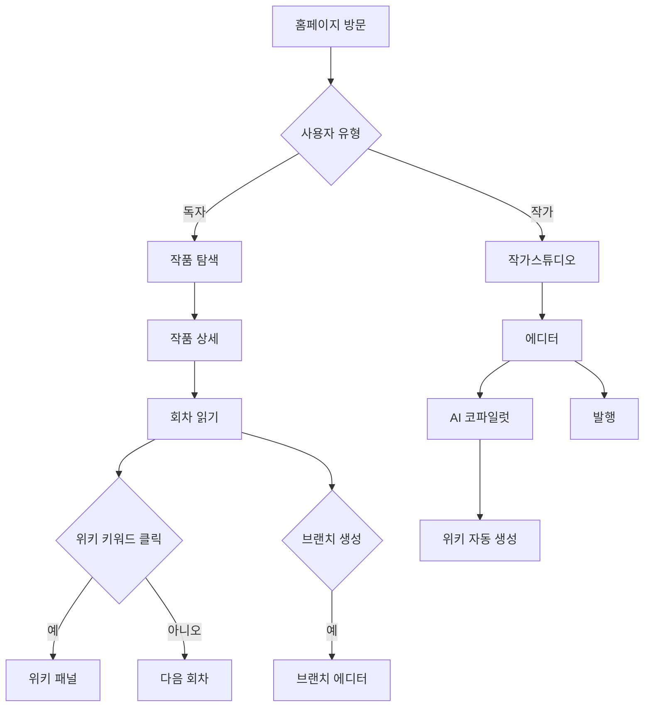

# 🎨 ForkLore UI/UX 설계 명세

**작성일**: 2026.01.02  
**작성자**: HueyJeong (with Gemini)  
**문서 버전**: v1.0

---

## 1. 정보 구조 (Information Architecture)

### 1.1 사이트맵

```
ForkLore
├── 홈 (/)
│   ├── 히어로 섹션
│   ├── 핵심 기능 소개
│   ├── 인기 작품
│   └── 인기 브랜치
│
├── 작품 (/novels)
│   ├── 작품 목록 (필터, 검색)
│   └── 작품 상세 (/novel/[id])
│       ├── 개요
│       ├── 회차 목록 (/novel/[id]/chapters)
│       ├── 리더 (/novel/[id]/read/[chapter])
│       ├── 위키 (/novel/[id]/wiki)
│       │   └── 위키 항목 (/novel/[id]/wiki/[term])
│       ├── 지도 (/novel/[id]/map)
│       └── 브랜치 목록 (/novel/[id]/branches)
│
├── 브랜치 (/branches)
│   ├── 브랜치 탐색
│   └── 브랜치 상세 (/branch/[id])
│       ├── 브랜치 리더 (/branch/[id]/read/[chapter])
│       └── 분기 포인트 비교
│
├── 랭킹 (/ranking)
│
├── 자유연재 (/free)
│
├── 작가스튜디오 (/studio)
│   ├── 대시보드
│   ├── 내 작품 관리
│   ├── 에디터 (/studio/edit/[novelId]/[chapterId])
│   ├── 위키 관리
│   └── 브랜치 병합 요청
│
├── 사용자 (/user)
│   ├── 내 서재
│   ├── 설정
│   └── 마일리지/코인
│
└── 인증 (/auth)
    ├── 로그인
    └── 회원가입
```

### 1.2 핵심 사용자 플로우



---

## 2. 페이지별 UX 설계

### 2.1 홈페이지

**목표**: 플랫폼의 핵심 가치를 전달하고 콘텐츠 탐색 유도

| 섹션 | 구성 요소 | 인터랙션 |
|------|----------|----------|
| **히어로** | 슬로건, 서브카피, CTA 버튼 2개 | - |
| **핵심 기능** | 4개 기능 카드 (문맥 위키, 브랜치, 지도, AI) | 호버 시 아이콘 강조 |
| **인기 작품** | 4열 그리드 카드 | 호버 시 이미지 확대, 그림자 |
| **인기 브랜치** | 3열 그리드 카드 + 추천 수 배지 | 클릭 시 브랜치 상세 |
| **CTA** | 그라데이션 배경 카드 | - |

### 2.2 소설 리더 (Novel Reader)

**목표**: 몰입형 독서 + 문맥 인식 위키 접근

#### 레이아웃 구조

```
┌─────────────────────────────────────────────────┐
│ [←] 작품명 / 회차 제목    [📖][🗺️][📋][⚙️]     │  ← 리더 헤더
├─────────────────────────────────────────────────┤
│                                                 │
│  ┌─────────────────────────────┐  ┌──────────┐ │
│  │                             │  │ 위키 패널 │ │
│  │      본문 콘텐츠             │  │ 또는     │ │
│  │      (위키 키워드 하이라이팅)   │  │ 설정 패널 │ │
│  │                             │  │          │ │
│  └─────────────────────────────┘  └──────────┘ │
│                                                 │
│  [← 이전 화] [책갈피] [좋아요] [다음 화 →]       │
│                                                 │
│  ┌─────────────────────────────────────────┐   │
│  │ 댓글 섹션                               │   │
│  └─────────────────────────────────────────┘   │
└─────────────────────────────────────────────────┘
```

#### 핵심 인터랙션

| 기능 | 트리거 | 반응 |
|------|--------|------|
| **위키 팝업** | 위키 키워드 클릭 | 사이드 패널에 해당 위키 정보 표시 |
| **글자 크기** | 설정 패널 슬라이더 | 실시간 본문 폰트 크기 변경 |
| **줄 간격** | 설정 패널 슬라이더 | 실시간 line-height 변경 |
| **다크 모드** | 헤더 토글 | 전체 테마 전환 |
| **회차 이동** | 하단 버튼 | 페이지 전환 |

### 2.3 세계관 위키 (Wiki Browser)

**목표**: 스포일러 없이 세계관 탐색

#### 문맥 인식 UX

```
┌──────────────────────────────────────────────┐
│ 📖 문맥 인식 모드                             │
│ 현재 245화까지 읽은 것으로 설정됨              │
│ ├─────────────────●────────────────────┤     │
│ 1화              245화              전체     │
└──────────────────────────────────────────────┘
```

- **슬라이더**: 사용자가 읽은 회차까지만 위키 정보 표시
- **필터링**: `firstAppearance <= currentChapter` 조건
- **배지 표시**: 각 항목에 "N화까지 공개" 표시

#### 탭 구조

| 탭 | 콘텐츠 | 카드 형식 |
|----|--------|----------|
| 등장인물 | 캐릭터 목록 | 이미지 + 이름 + 역할 + 요약 |
| 장소 | 위치 목록 | 썸네일 + 이름 + 유형 + 요약 |
| 아이템 | 아이템 목록 | 이미지 + 이름 + 희귀도 + 요약 |
| 개념 | 마법/시스템 | 아이콘 + 이름 + 유형 + 요약 |

### 2.4 브랜치 탐색기 (Branch Explorer)

**목표**: IF 스토리 발견 및 정사 편입 메커니즘 이해

#### 탭 구조

| 탭 | 콘텐츠 |
|----|--------|
| **활성 브랜치** | 연재 중인 팬픽 목록 + 편입 후보 배지 |
| **정사 편입** | 병합된 브랜치 목록 + 설명 카드 |
| **인기순** | 추천 수 기준 랭킹 |

#### 브랜치 카드 정보

- 브랜치 제목
- 원작 작품명 + 분기 포인트 (N화)
- 작가명
- 추천 수, 조회수, 회차 수
- 최근 업데이트 시간
- 상태 배지: `연재중`, `정사 편입 후보`, `검토 중`

### 2.5 작가 에디터 (Novel Editor)

**목표**: 효율적 집필 + AI 보조

#### 레이아웃 구조

```
┌──────────────────────────────────────────────────┐
│ [←] 작품명 / N화 작성 중   [미리보기][임시저장][발행][✨]│
├──────────────────────────────────────────────────┤
│                                                  │
│  ┌────────────────────────────┐  ┌────────────┐ │
│  │ 회차 번호: 제 245 화       │  │ AI 코파일럿 │ │
│  │ [예약 발행]                 │  │            │ │
│  │                            │  │ [위키 제안] │ │
│  │ 제목: _______________      │  │ [일관성 검사]│ │
│  │                            │  │            │ │
│  │ 본문:                       │  │ - 아카데미아│ │
│  │ ┌────────────────────┐    │  │   (신규 95%)│ │
│  │ │                    │    │  │ - 흑마법    │ │
│  │ │  마크다운 에디터     │    │  │   (업데이트) │ │
│  │ │                    │    │  │            │ │
│  │ └────────────────────┘    │  │ [빠른 작업] │ │
│  └────────────────────────────┘  └────────────┘ │
└──────────────────────────────────────────────────┘
```

#### AI 코파일럿 기능

| 기능 | 설명 |
|------|------|
| **위키 제안** | 본문 분석 → 새 위키 항목 제안 + 기존 항목 업데이트 제안 |
| **일관성 검사** | 이전 회차와의 설정 충돌 경고 |
| **문장 다듬기** | 선택 텍스트 스타일 개선 제안 |
| **이전 회차 참조** | 관련 이전 내용 검색 |

---

## 3. 인터랙션 패턴

### 3.1 마이크로 인터랙션

| 요소 | 호버 | 클릭 | 로딩 |
|------|------|------|------|
| 카드 | 그림자 확대 + 이미지 스케일 | 페이지 전환 | 스켈레톤 |
| 버튼 | 배경색 변화 | 리플 효과 | 스피너 |
| 위키 키워드 | 밑줄 스타일 변경 | 사이드 패널 오픈 | - |
| 탭 | 텍스트 색상 변화 | 언더라인 이동 | - |

### 3.2 페이지 전환

- **기본**: 즉시 전환 (Next.js App Router)
- **권장**: 글로벌 로딩 인디케이터 (헤더 하단 프로그레스 바)

### 3.3 토스트 & 알림

| 유형 | 용도 | 스타일 |
|------|------|--------|
| 성공 | 저장 완료, 발행 완료 | 녹색 테두리 |
| 경고 | AI 일관성 경고 | 노란색 테두리 |
| 오류 | 저장 실패 | 빨간색 테두리 |
| 정보 | 새 알림, 브랜치 편입 | 파란색 테두리 |

---

## 4. 반응형 전략

### 4.1 브레이크포인트별 변화

| 요소 | 모바일 (< 768px) | 태블릿 (768-1024px) | 데스크톱 (> 1024px) |
|------|-----------------|-------------------|-------------------|
| 네비게이션 | 햄버거 메뉴 | 확장 메뉴 | 확장 메뉴 + 검색 |
| 작품 그리드 | 1열 | 2열 | 4열 |
| 리더 패널 | 오버레이 모달 | 오버레이 모달 | 고정 사이드바 |
| 에디터 | 단일 열 | 단일 열 + 토글 패널 | 고정 사이드바 |

### 4.2 모바일 우선 고려사항

- 터치 영역 최소 44px
- 스와이프 제스처 (회차 이동)
- 모바일 검색 전용 영역 (헤더 하단)

---

## 5. 접근성 (Accessibility)

### 5.1 키보드 네비게이션

| 키 | 기능 |
|-----|------|
| `Tab` | 다음 인터랙티브 요소 |
| `Shift+Tab` | 이전 인터랙티브 요소 |
| `Enter/Space` | 활성화 |
| `Esc` | 패널/모달 닫기 |
| `←/→` (리더) | 이전/다음 회차 |

### 5.2 스크린 리더 지원

- 모든 이미지에 대체 텍스트
- 의미 있는 랜드마크 (header, main, nav, footer)
- 동적 콘텐츠 업데이트 시 `aria-live` 영역 사용

### 5.3 색상 대비

WCAG AA 기준:
- 일반 텍스트: 4.5:1 이상
- 큰 텍스트 (18pt+): 3:1 이상
- UI 컴포넌트: 3:1 이상

---

## 6. 성능 UX

### 6.1 로딩 전략

| 요소 | 전략 |
|------|------|
| 작품 목록 | 무한 스크롤 + 스켈레톤 |
| 작품 이미지 | 지연 로딩 + blur placeholder |
| 위키 데이터 | 클라이언트 사이드 캐싱 |
| 소설 본문 | 서버 사이드 렌더링 |

### 6.2 오프라인 지원 (향후)

- 읽던 회차 로컬 캐싱
- 오프라인 읽기 모드

---

## 7. 에러 처리

### 7.1 에러 페이지

| 코드 | 메시지 | 액션 |
|------|--------|------|
| 404 | "페이지를 찾을 수 없습니다" | 홈으로 이동, 검색 |
| 500 | "서버 오류가 발생했습니다" | 새로고침, 문의하기 |
| 네트워크 | "연결을 확인해주세요" | 재시도 |

### 7.2 빈 상태 (Empty State)

| 상황 | 메시지 | 액션 |
|------|--------|------|
| 검색 결과 없음 | "검색 결과가 없습니다" | 다른 키워드 추천 |
| 내 서재 비어있음 | "아직 읽은 작품이 없습니다" | 작품 탐색 버튼 |
| 브랜치 없음 | "아직 브랜치가 없습니다" | 브랜치 만들기 버튼 |

---

## 문서 끝
